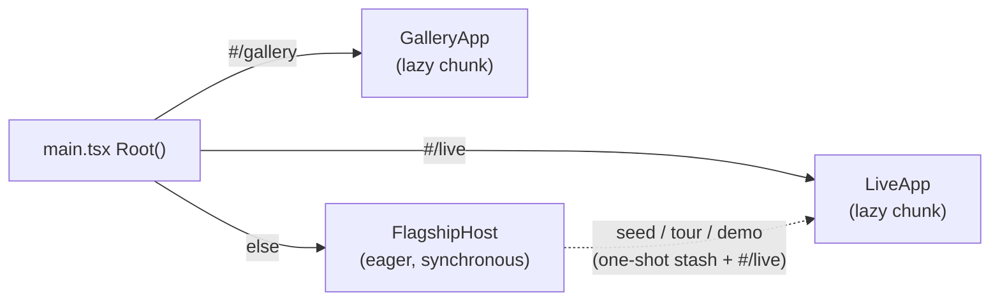
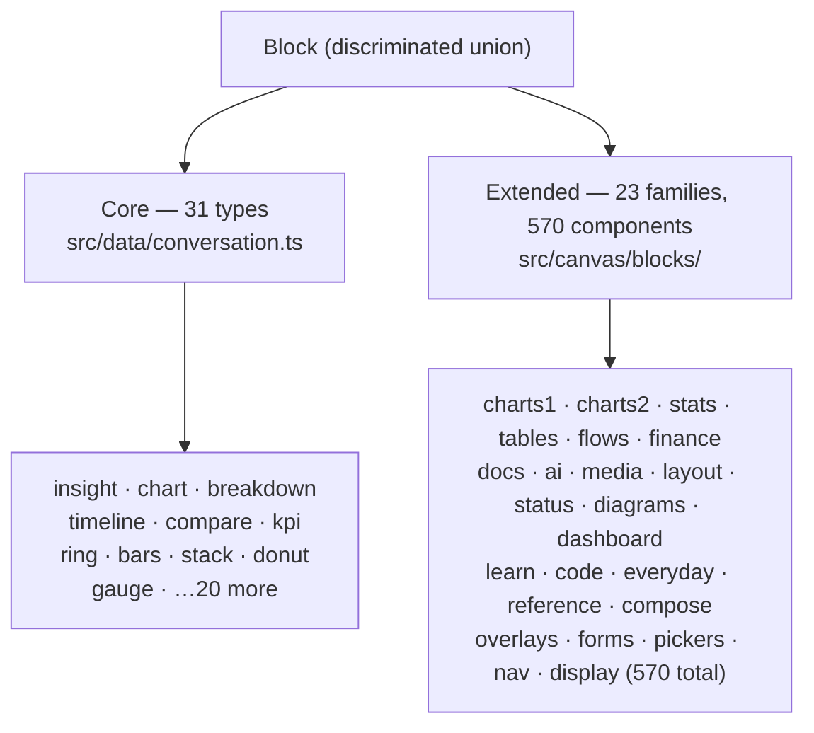
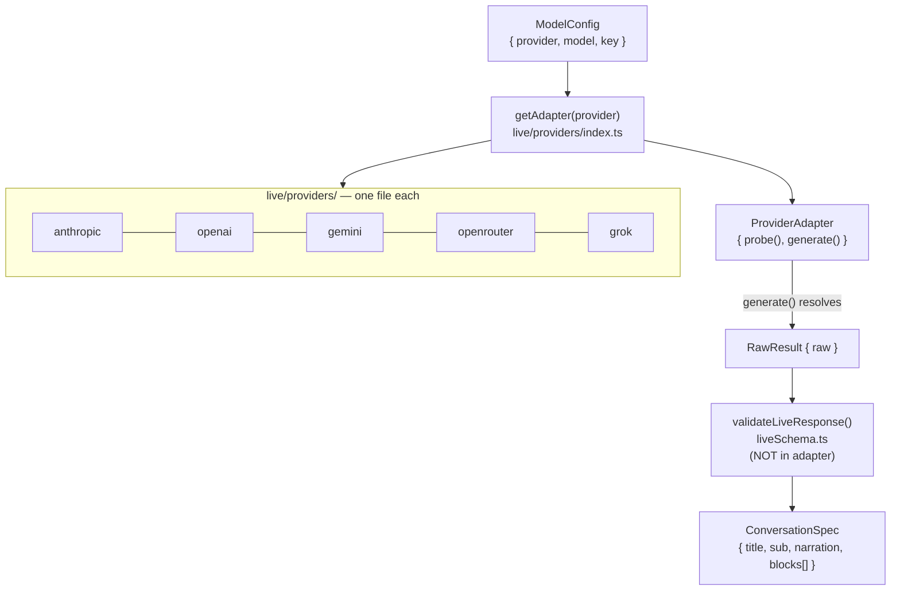
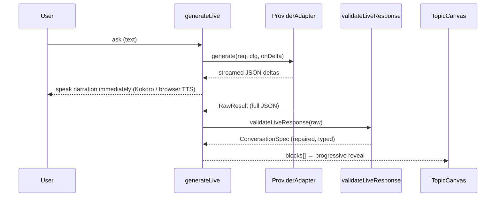

# Architecture

Mavéa is one product with one component library and one stylesheet. `main.tsx` routes on the
URL hash: `#/live` mounts **Live** (`live/LiveApp.tsx`, the real experience), `#/gallery` the
visual library, and anything else mounts the **landing** (`flagship/FlagshipHost.tsx`, the
marketing front door). The landing owns no conversation machinery at all — every interactive
path hands off into Live: the hero composer stashes a seed question (`live/seedQuery.ts`),
"Take the tour" boots Live's walkthrough mode (`tour/tourEntry.ts`), and a demo card boots
Live's demo replay mode (`demo/demoEntry.ts`).



## Scripted playback: the tour and the demo replays

Live is also the stage for two key-free scripted experiences. Both replay REAL model output on
the real surface — same chrome, same reveal walks, no provider call at play time:

- **The first-run walkthrough** (`tour/`): 10 core chapters (41 in all, counting the deep-linkable
  extras), each teaching one feature by driving real controls. `useTourDriver` plays chapters
  through `TourOps` — a bag of closures LiveApp passes in (type into the composer, show a frame, open Export, drag the bend dial, …).
- **The demo replays** (`demo/`): a cast of recorded persona sessions (`demo/cast.ts`), each a
  hand-authored script of asks + feature beats (`demo/scripts.ts`) whose answers were generated
  once against a real model and frozen. `useDemoDriver` is a thin sibling of the tour driver —
  both share the timing primitives in `tour/driverKit.ts` and the same `TourOps` object, so a
  demo can only ever show a feature the real surface has.

The recorded answers are baked by `scripts/build-demo-corpus.mts`: it runs each script's asks
through the ACTUAL `generateLive` pipeline, turn by turn with real accumulated history, settles
each turn through the same `live/settleTurn.ts` the live surface uses (so merge modes,
spotlight tours, and bend dials are decided by production code, never authored), and writes one
shard per persona to `demo/corpus/<id>.generated.json`. Shards load lazily (one chunk each) when
that demo boots; `tests/demo-corpus.test.ts` keeps cast, scripts, and shards in lockstep, and
the honesty rule is enforced at authoring time — every ask is publicly answerable, pure math on
numbers the persona states, or planning advice, so no answer requires invented data.

Choreography timing still speaks the declarative `Beat` vocabulary (`orchestration/state.ts`):
a beat is a partial presence/canvas snapshot plus how long to hold it. Live generates beats for
its reveal walks (`live/generateBeats.ts`) and replays (`live/replay.ts`); the players live in
LiveApp and the drivers above.

## Presence: a CSS state machine

`presence/Presence.tsx` is intentionally tiny. It renders a fixed DOM — a halo and one SVG
jelly (a mood-gradient bell over four tentacle curtains, sparkly eyes, a ripple smile) —
and sets three attributes: `data-state`, `data-emotion`, `data-gaze`. Animation lives in the
`.presence` rules in `styles/presence-canvas.css`, driven off those attributes; mood is hue
(the whole bell drifts teal when something verifies, rose when she's delighted) and state is
current (beads of data race up the tentacles while a turn is in flight). Nothing ever applies
an inline transform to `.presence` or an ancestor — it would fight the bob/swell/blink
keyframes. The one dynamic input is a `--voice-energy` CSS variable, published from the real
spoken audio by `voice/voiceEnergy.ts` (a WebAudio analyser on the Kokoro stream) and read by
the mouth and aura, so she visibly speaks the actual words — a variable, never a transform, so
the keyframes stay intact. On Live the `data-emotion` is read from the answer itself
(`presence/expression.ts`: warm on a genuine positive, concerned on a real caution). The
component is memoized so the orchestrator's frequent re-renders never re-reconcile the face.

## The canvas

A topic's answer is a list of typed **blocks**. `data/conversation.ts` defines a discriminated
union (`Block`) over 31 core visualization types — insight, chart, breakdown, compare, timeline,
ring, gauge, diff, schema, preview, `composite`, and more — each with its own strict prop type.
(The 31 are the 30 types `TopicCanvas` renders with a built-in branch plus `composite`, which nests
other blocks and so lives in the core union.)

`canvas/TopicCanvas.tsx` renders the blocks: it lays them out on a 12-column grid, applies the
spotlight/dim treatment on the grid wrapper (so _every_ block type can be spotlighted, not just
one), and maps each block to its component. Beyond the core union, an **extended library** under
`canvas/blocks/` adds 570 components across **23 self-contained families** (data-viz & content:
`charts1 charts2 stats tables flows docs ai media layout status diagrams learn code everyday
reference finance`; the UI kit: `overlays forms pickers nav display compose`; plus `dashboard`). Each family is a 4-file unit
(`types.ts` · `*.tsx` · `registry.tsx` ·
`styles.css`) looked up by string key — so the library grows by adding a family file, one
registry line, and one `familyMap.ts` line, never by widening the core union or editing the
renderer.

The library is **code-split per family**: `TopicCanvas` resolves a block through
`canvas/blocks/loader.ts`, which maps its type to a family (`familyMap.ts`) and dynamic-imports
just that family's registry chunk — a canvas render downloads only the families its answer uses
(typically 4–8 of 23), prefetched while the answer streams so every card still mounts together.
The merged `EXTENDED_REGISTRY` (`canvas/blocks/index.ts`) remains for the surfaces that
genuinely want everything at once — the gallery primes the loader with it, and the export/figure
path imports it directly.

Every chart is hand-rolled SVG with no external dependency. That keeps the bundle tiny and the
rendering fully under our control.



### On-the-fly visuals

When no library block fits an ask, Live can compose one rather than fall back to prose — without
generating any code. Three primitives are available by default and can be removed from the model menu
with the `generativeBlocks` setting:

- **`diagramflow`** (`canvas/blocks/diagrams/`) — a freeform node/edge figure (cycles, state
  machines, feedback loops, concept maps) the model fills with real data; auto-laid-out SVG in the
  design system.
- **`composite`** — a model-arranged sub-grid of _other, already-vetted_ blocks. The literal "build
  a new component on the fly": a novel arrangement where every region is still a real typed `Block`
  rendered by the same path (recursive, depth-capped). It lives in the core union because it nests
  `Block`s, and `TopicCanvas` renders it directly.
- **`svgblock`** (`canvas/blocks/media/SvgBlock.tsx`) — the Tier-3 escape hatch: the model draws raw
  SVG for a visual no native component covers (a molecule, a circuit, a custom infographic). The
  markup is untrusted, so it goes through the deny-by-default `sanitizeSvg` before it reaches the
  DOM; design tokens still resolve by CSS inheritance, so it stays light/dark-aware.

The model never emits component code — only a typed spec coerced by hand-written builders
(`buildDiagramFlow` / `buildComposite` in `engine/liveSchema.ts`), so a generated visual is on-brand
and safe by construction. The family is **gated at exposure** (`GENERATIVE_BLOCK_TYPES` in
`live/select/catalog.ts`): when the setting is off, these types are stripped from the per-turn prompt
menu, the schema, and the validator gate — so a paid model is never even told they exist and spends
zero tokens on them.

### The catalog: a compact index over lazily-fetched details

The component catalog is the one structure whose size tracks the library rather than the answer, so
it is stored in two halves. Authoring lives in `canvas/blocks/catalog/families/<family>.ts`. From
there `pnpm gen:catalog` derives:

- **`facts.generated.ts`** — one tuple per component (family, archetype, data shapes, tier, wow,
  required props…), with every repeated string interned into a shared table. This is what the
  selector ranks over, and it is always resident: ~49 KB of source, ~13 KB gzipped, for 600
  components. Objects with repeated keys would be ~130 KB.
- **`catalog/details/shard*.ts`** — the blurbs, optional props, item shapes and prop hints. These are
  ~70% of the catalog's bytes and are read by only two consumers: the prompt menu (for the ≤30
  components a turn offers) and the generic coercer (for the handful it produces). They are fetched
  in small canonical-order shards, on demand.

Sharding, rather than splitting by family, is deliberate and was chosen by measurement. The selector
caps its picks at two per family for visual variety, so a menu spans ~17 of the 23 families; a
family-sized module ships roughly thirty times more prose than the turn ever quotes. Switching to
eight-component shards took a turn's detail payload from ~126 KB gzipped to ~43 KB, and — the point
of the exercise — made it scale with the MENU rather than the library, so a 10,000-component catalog
costs a turn no more than today's does.

Two rules keep the halves honest, both enforced by tests. `catalogMeta()` returns `undefined` until
`ensureDetails(types)` has fetched a type's shard — failing closed, because a meta missing its item
contracts would let the coercer emit a malformed block in silence. And nothing in the app may import
`catalog.data.ts` or a family file directly; the eager-import graph test fails if it does.

### Designed PDF export

The **Export** action (Live's Share menu and the demo topbar) opens a modal that renders an answer
as a print-grade US-Letter PDF in one of **10 templates** (Editorial, Swiss, Terminal, Executive,
Luxury, Medical, School, Financial, Research, Legal). It lives in `src/export/` (a sibling of
`clip/`) and is a pipeline of pure-ish stages with one shared renderer:

`ConversationSpec[]` **→ normalize** (`model/`) → a fixed vocabulary of ~12 **section archetypes**
(finding callout, figure grid, ranked list, rating matrix, checklist, metric tiles, distribution
bars, vertical timeline, numbered milestones, spec table, spotlight, prose) **→ paginate**
(`paginate/`: offscreen measurement + greedy packing into Letter pages, splitting over-tall tables,
then balancing the final spread so the closing page never strands a lone widow section — chapter
lead pages keep their fresh-page start) **→ render** (`render/ExportDoc.tsx`) with the chosen
**skin**.

The block→archetype map is two-tier: an explicit table for the non-composite core types
(`composite` routes through its child regions), then each extended block's declared `DataShape`
(`canvas/blocks/catalog/meta.ts`), then a `prose` catch-all — so a new block type needs no export
work, and nothing ever renders blank. One archetype is special: a block whose value IS a bespoke
visual (a Sankey, a state machine, a candlestick, a code listing, a map) routes to **`figure`**,
which keeps the real `Block` and renders its actual canvas component via the shared
**`canvas/embed/`** layer — themed to the skin (a token bridge re-points `--presence`, `--text-*`,
`--grid-line`… at the skin palette), scaled to fit the page, and raster-gated (`ensureFigureReady`
awaits fonts, Shiki/KaTeX, and Leaflet tiles before capture). `embedClass` decides eligibility from
one catalog capability (`fluid` viewBox SVG vs `flow` count-growing vs `none`); the same `figure`
kind + `FigureEmbed` is reused by the slide layer below, so exports and decks render the real
conversation instead of a flattened summary. A **skin** (`skins/`) is mostly
data (palette + fonts + brand); the 15 shared, token-driven section components serve all 10, and a
skin overrides only its bespoke masthead (`skins/chrome/mastheads.tsx`) — so the design language is
faithful without 10× duplication. Mastheads use only the answer's real metadata (title, sub, topic,
date, sources); they never fabricate the demo content of the reference templates (real-data-only).

Output is **pixel-perfect download** by default — a fresh, natural-size offscreen mount rasterized
per page (`modern-screenshot`) and assembled into a PDF (`jspdf`), both **lazy-loaded, bundled**
dependencies like the clip encoders (code-split, no CDN fetch) — plus a **vector Print** path
(`pipeline/printFallback.tsx`) that mounts the doc in a body-level `.mavea-export-doc` portal and `window.print()`s it, isolated from the legacy
canvas `print.css` by `export-print.css`.

### Presentation deck + the slide layer

The Export modal opens on a **Presentation** format (a Document toggle keeps the PDF above): the same
answer composed into a **16:9 slide deck** in one of **10 styles** (Folio, Meridian, Noir, North,
Lumen, Grid, Terra, Cobalt, Press, Sol). The shared **slide layer** lives in `src/slides/`:

`Section[]` (reused from the export's `normalize`) **→ compose** (`model/compose.ts`: archetype →
one of 15 **slide layouts** — cover, divider, agenda, key figure, comparison, table, roadmap,
process, chart, figure, quote, team grid, full-bleed, prose, closing — deriving
cover/agenda/closing, labelling prose kickers with the running chapter title, and splitting
over-long sections into bounded continuation slides; item caps rise for short single-line content and stay conservative
for wordy content) **→ `SlideCanvas`** (a fixed 1920×1080 block; `SlideStage` wraps it in a
scale-to-fit transform for previews/Present). Layouts are **density-aware fill-the-band**
compositions: headings pin under the kicker rule, lists/tables/charts distribute their rows across
the remaining band (thicker bars and larger type at low counts), short prose gets a standfirst-lede
statement treatment, and small figures enlarge (bounded) via `FigureEmbed`'s stage-only upscale —
so a three-item slide reads as designed scale, not leftover space. A
**`SlideSkin`** (`skins/`) is mostly data (palette + Google fonts + decor mode); 15 token-driven
shared layouts serve all 10, with a few structural overrides (`skins/layouts/overrides.tsx` — Noir's
centred cover, North's full-colour statement, Press's drop-cap). Real-data-only holds: media slides
(team/full-bleed) appear only with real images; nothing is fabricated.

Export reuses the document pipeline's rasterizer via a parameterized `rasterToPdf` (page format +
orientation + selector), emitting a **landscape PDF**, one slide per page (`pipeline/exportDeck.tsx`).
**Present mode** (`live/present/`) renders the _same_ composed deck through `SlideStage` in the
chosen style, so presenting full-screen is identical to the export; its style picker is the ten
skins (`present/personas.ts`). `#/slidelab` is a QA gallery (every layout × every skin), the slide
counterpart to `#/reel`.

## Voice

`voice/types.ts` defines one `VoiceController` interface. Two implementations satisfy it:

- **`WebSpeechVoice`** — the browser's native `SpeechRecognition` with continuous capture and
  a silence grace window. Its speak() is a no-op: Mavéa's only voice is Kokoro.
- **`VadVoice`** — the always-on path: on-device voice-activity detection gating a Whisper
  transcription, with echo suppression while Mavéa is speaking.

A controller never touches presence; it only emits results (`user said X`, run by the surface
exactly as typed text would be) and state changes (`listening` / `heard` / `speaking`). The
surface maps those to the face, so one place — and only one — owns the presence.

Separately, `voice/tts.ts` is the spoken-answer playback: it speaks through a local **Kokoro**
server (`voice/kokoro.ts`) when one is reachable — captions carry the line when it isn't.

## Live mode

Live mode (`live/`) is model-agnostic. The seam is `ProviderAdapter` (`live/providers/types.ts`):
one interface with a `probe` and a `generate`. Five adapters implement it — Anthropic, OpenAI,
Gemini, OpenRouter, and xAI Grok — and `live/providers/index.ts` is a registry mapping a
`ProviderId` to its adapter plus the UI metadata (label, default model, whether a key is needed).
Adding a provider is one file and one registry entry.

The flow for a turn:

```
useLiveTurn ── generate(request) ──▶ ProviderAdapter ──▶ raw model output (streamed)
     │                                                          │
     │  narration-first: speak the headline as soon as          ▼
     │  it streams in (streamParse.extractNarration)     validateLiveResponse
     └──────────────────────────────────────────────▶  (repair → typed ConversationSpec)
```



A few ideas make it feel instant, stay safe, and stay cheap:

- **Narration-first streaming.** The system prompt asks the model to emit a short spoken
  `narration` field first. `live/streamParse.ts` scans the partial JSON for that one complete
  string and hands it back the moment it arrives, so the face speaks within a few hundred
  milliseconds while the rest of the blocks are still generating. The spoken line is capped to a
  conversational length for the ask (`live/effort.ts` `capSpoken` — a tweet for a trivial question,
  a couple of sentences for a rich one); the depth lives in the canvas, not the monologue.
- **One validation core.** Adapters do transport only; they never validate or render. Every
  response — however malformed — flows through `engine/liveSchema.validateLiveResponse`, which
  coerces loose JSON into safe, fully-typed blocks (dropping unknown types, snapping colors to
  the token set, clamping numbers, capping count). Catalog metadata drives the shape repair:
  `itemShapes` normalizes object-item arrays, `stringItems` flattens plain-string arrays (an
  objectified `steps: [{text}]` becomes the strings the renderer reads). An unsalvageable
  response degrades to an honest fallback insight rather than a crash.
- **Validated ⇒ visible.** A block that survives validation always renders something: its
  designed component, or — when the component throws, its type has no renderer, or its family
  chunk fails to load — its `canvas/FallbackCard`, a plain card projecting the block's real text
  (`canvas/lib/projectText.ts`). Content never silently vanishes, and a concept-section header
  can never sit orphaned above an empty grid. Enforced across the whole catalog by
  `tests/live-coercion-gauntlet.test.tsx` and `tests/catalog-string-items.test.ts`.
- **Cheap for a long conversation.** `live/history.ts` resends only the last few turns verbatim and
  folds older ones into a short recap, so per-turn input cost stays roughly flat however long the
  chat runs; reasoning effort scales to the ask (`live/effort.ts`, mapped to a provider's thinking
  dial, default minimal); and the stable system prompt is sent first so a provider's implicit cache
  (Gemini) absorbs the large prefix after the first turn.
- **Grounding is the user's choice.** A `SearchMode` (off / free Wikipedia retrieve-then-read /
  real-time provider grounding) gated by a freshness check decides whether a turn searches at all.
  When an adapter reports `nativeWebSearch`, `generateLive` lets it ground itself (Gemini's
  `google_search` + `url_context`, which on Gemini 3 coexist with the constrained schema) and reads
  the real source URLs back from `groundingMetadata`; otherwise the app does retrieve-then-read. Most
  turns search nothing, so they cost nothing extra.
- **Every turn is replayable.** `useLiveTurn` captures a `TurnFrame` per turn (the rendered canvas,
  the spoken line, the tour). `ReplayOverlay` + `live/replay.ts` turn those frames back into a played
  walkthrough — one answer, from the start, or from a point onward — reusing the same `liveTourBeats`
  choreography, so the user can scroll back to a canvas a later turn cleared and watch it again.

Providers that support it use constrained decoding to guarantee the _structure_ — hosted models
via tool-forcing / `json_schema` / `responseSchema`, each via a JSON schema
passed as the sampler `format` with `minItems: 3` on `blocks` (1 for an explicitly brief ask), so a
small model can't short-circuit to a one-block or empty canvas. The validator always owns prop correctness, and `generateLive`
never throws.

### From tokens to a rendered canvas

This is the heart of "real conversations": a model produces **data, never UI**, and that data
travels the same last mile a scripted answer does.

```
 model output (streamed JSON)        validate + repair                 ConversationSpec        render
 ┌───────────────────────────┐      ┌────────────────────────┐       ┌──────────────┐
 │ { narration, title, sub,  │      │ validateLiveResponse:   │       │ { title,     │     TopicCanvas
 │   blocks: [               │      │  • drop types not in    │       │   sub,       │     switch (block.type)
 │     { type, props },      │ ───▶ │    the tier's set       │ ────▶ │   blocks:    │ ──▶  insight → InsightCard
 │     { type, props }, … ]  │      │  • map loose field names│       │   Block[] }  │      chart   → TrendChart
 │ }                         │      │  • snap colors→tokens,  │       └──────────────┘      ring    → RingStat
 └───────────────────────────┘      │    clamp #s, cap count, │                              donut   → Donut …
            │                       │    assign col + delay   │                              else → EXTENDED_REGISTRY[type]
            │ narration-first:      │ autoFix (free): 100%-   │
            ▼                       │   normalize breakdowns, │
   speak the headline now          │   align chart↔labels    │
   (Kokoro / browser TTS)          │ + ONE self-correct call │
                                    │   only on a hard issue  │
                                    └────────────────────────┘
```



Three things make the mapping work:

- **The model speaks "block", the renderer speaks "component."** A block is just
  `{ type: 'breakdown', props: { … } }`. `TopicCanvas` switches on `type` to the matching
  component (`insight → InsightCard`, `chart → TrendChart`, `ring → RingStat`, `donut → Donut`, …),
  falling through to the `canvas/blocks/` registry for the extended library. Live and Demo use the
  **same renderer and `ConversationSpec` contract**; their pixels still depend on their respective
  content, viewport, theme, and runtime state. The model is, in effect, authoring a validated
  `ConversationSpec` on the fly.
- **The model only sees the blocks it can fill — chosen per turn.** A catalog-driven selector
  (`live/select/`) does retrieve-then-rank over the component catalog: it classifies the ask into data
  shapes, draws a small, varied menu of fitting + impressive components (weighted random, so the same
  ask reaches for different visuals across turns), and always includes a `BASE_FLOOR` of eight reliable
  staples. The model's capability tier (`'frontier' | 'mid' | 'small'`) sets how far the draw reaches
  and the menu budget; a small/local model is held to the safe set. The chosen menu goes into the
  system prompt, and `validateLiveResponse` gates on the **same** set — so the model can't reach for a
  type the prompt never taught, and nothing the prompt promised gets dropped. The opt-in generative
  family is excluded from this menu unless the user enabled it (see _On-the-fly visuals_ above).
- **Rich by construction, not by hope.** The `minItems: 3` schema / constrained decoding
  (hosted) guarantees a well-formed object with several varied blocks every turn, which is what keeps
  Live answers feeling like the demos instead of a lone paragraph.

### The eval harness

`live/eval/` is a real evaluation, not a vibe check. `golden.ts` is a set of cases, each a user
ask plus the invariants a correct visual answer must satisfy — which block type _fits_ the data,
which would be _wrong_ (a time-series `chart` for a category split is the classic error), and
whether estimates are labeled honestly. `score.ts` grades a response against those invariants and
aggregates pass rates and latency percentiles; `run.ts` drives any provider through the set.
`pnpm eval` produces a scorecard so "accurate" is a number, not an opinion.

### Actions: doing, not just showing

An answer can end in a concrete next step, so Live can emit one more block type — an `action`
(`live/actions/`). It travels the same data path as every visual block, with a confirm gate and a
credential boundary bolted on:

- **Proposed, never auto-run.** The system prompt advertises only the actions whose integration the
  user connected (`actionsMenu` over `getConnectedMcps`, persisted in localStorage). The model may
  add at most one `{ type: 'action', props: { id, args } }` block; `validateLiveResponse` drops it
  unless the id is in the catalog **and** `action` is in the tier's allowed set — defense in depth.
  `TopicCanvas` renders it as a `canvas/ActionProposal` confirm card, never an immediate effect.
- **The credential boundary.** On confirm, `runAction` POSTs to a same-origin `/actions/<id>` proxy
  — the same isolation pattern as the BYOK `/llm/*` proxies — which forwards to the **actions
  gateway** (`gateway/`), a dependency-free Node service (built-in `http` + global `fetch`, no build
  step). The gateway owns the credentials (Slack webhook, Google OAuth token in its environment) and
  makes the real call; a browser never holds a token. This is the _single shared gateway_ model: one
  deployment, one set of connected accounts — per-visitor OAuth would need a stateful backend and is
  deliberately out of scope. An unconfigured connector returns an honest "not set up here" the card
  shows verbatim. Setup and how to add a connector: [`gateway/README.md`](./gateway/README.md).

### Memory: remembering across sessions, and learning how you like answers

With memory enabled (off by default), Live personalizes future turns from durable facts about the
user — **local-first, on the same single model call, and provenance-gated so a stored guess can
never poison an answer**. It reuses existing seams rather than adding a pipeline:

- **Capture is in-turn, not a second call.** The system prompt gains one instruction to surface
  durable facts as a `memory: { concept, body }[]` field on the response — an additive optional
  property like `chips`/`tour`/`continuity`, parsed by `liveSchema.buildMemory`. So a fact comes back
  _with_ the answer at no extra cost, and is simply **absent** on Gemini's strict `responseSchema`
  (intended graceful degradation; don't add it to the schema — that would force the field every turn).
- **Every fact is provenance-tagged.** `live/memory/provenance.classifySource` decides, at write
  time, where a fact came from: its words echo the user's _and_ it invents no figure → `user-stated`;
  the turn cited a source → `web-grounded`; otherwise it's the model's guess → `model-inferred`. Only
  the trusted tiers are ever injected as fact; a guess — or any fabricated number, matched separately
  from its topic words — is injected under an explicit **"unconfirmed"** tag the model is told never
  to assert. This is how the real-data-only rule survives a self-improving loop.
- **The store supersedes, it doesn't overwrite.** `live/memory/store.ts` (v3) holds typed concept
  **nodes** — `semantic` (facts/preferences) and `procedural` (lessons) — each carrying its source
  tier, one bounded prior-body snapshot, and a reinforcement count. A restated fact reinforces; a
  changed one supersedes, keeping the prior body for "you used to tell me…". Still the `useLiveConfig`
  idiom (cache + `localStorage` + `CustomEvent`, coerce-on-read, never throws), gated on the toggle,
  fire-and-forget; capped at 50 with slots reserved for procedural lessons. Migrates v1/v2 on load.
- **Recall is query-conditioned.** `live/memory/retrieve.rankForInjection` scores nodes by
  `relevance × recency × importance` (pure local math, no embeddings) and `inject.buildMemoryContext`
  prepends the top few under a bounded, **data-fenced** block — the current question always wins, and
  the block is sanitized so a stored body can't act as an instruction to the next turn.
- **It learns how to answer you.** A correction (declared, or drawn on the answer) becomes a durable
  `procedural` lesson; `retrieve.proceduralHints` turns those — plus a stated format/depth preference
  — into advisory hints that nudge component selection (`select/rank.weightFor`) and add one prompt
  line. They never override a strong shape-fit or the safe base set, and only a user-grounded lesson
  may steer, so behaviour degrades cleanly to baseline when memory is off or on a small model.
- **Honest, user-owned, and measured.** Facts leave the device only inside the next prompt to the
  chosen provider (on a local model, never). `LiveSettings` lists every node with per-item delete,
  Forget-all, and OKF export; a quiet toast marks a save. A multi-turn eval (`eval/runMemory`) answers
  each probe with memory on vs off and reports the personalization lift with a groundedness guard, so
  the benefit is provable, not asserted. No new dependency, and the memory modules are framework-free
  leaves so the Node eval path stays clean.

### The conversation layers

Everything beyond the core turn is a **self-contained module under `live/`** that plugs into one of
four existing seams — additive response fields, the `selectedBlocks` grounding path, a local store
(the memory-store idiom: cache + `localStorage` + `CustomEvent`), or a side-channel adapter call
that never touches turn state. None of them widen the core pipeline:

| Layer                                                                                                            | Modules                                                                    | Seam it rides                                                                                                                                                                                                                                                                                                                                                                                                                                                      |
| ---------------------------------------------------------------------------------------------------------------- | -------------------------------------------------------------------------- | ------------------------------------------------------------------------------------------------------------------------------------------------------------------------------------------------------------------------------------------------------------------------------------------------------------------------------------------------------------------------------------------------------------------------------------------------------------------ |
| **Voice-first shell** — answer hero, dock composer, session rail, 6×2 theme templates                            | `voice/`, `templates.ts`                                                   | presentation only; templates are full token-contract rebinds under `data-template`                                                                                                                                                                                                                                                                                                                                                                                 |
| **Turn states** — listening card, labeled skeletons, said-vs-shown speak ribbon                                  | `turnstate/`                                                               | the streamed `"type"` key + a phrase-level audio clock                                                                                                                                                                                                                                                                                                                                                                                                             |
| **Drawn gestures (Mavéa's)** — circles/underlines/arrows on the exact figure being spoken about                  | `annotate/`                                                                | model-authored `mark` on tour stops, located in the card's real DOM (no reason → no ink); teach mode widens targeting                                                                                                                                                                                                                                                                                                                                              |
| **Ink (the user's)** — draw on the answer to ask; circle/strike/arrow/underline/?/bracket/compare                | `annotate/` (`recognize`/`resolve`/`useInkIntent` + Mark tool)             | a pure gesture classifier + a DOM resolver targeting the smallest **part** the stroke crosses (a bar/row/value, not the whole card); rides the `selectedBlocks` seam via `buildInkIntentContext` (Live grounds a turn; Demo spotlights). "Mark" is the user's ink — distinct from the "Pen" toggle (Mavéa's output annotations)                                                                                                                                    |
| **Edit its mind / self-healing history**                                                                         | `understand/`, `heal/`                                                     | additive `understood[]` / `corrects` response fields; a fix is one correction turn; a corrected moment is marked, never silently rewritten                                                                                                                                                                                                                                                                                                                         |
| **Blocks fuse / ask-about-this**                                                                                 | canvas chrome + `selectedBlocks`                                           | pin two or more cards, then "Fuse N into one" grounds the next turn in every pinned block's real props                                                                                                                                                                                                                                                                                                                                                             |
| **The Blank Space** — answers with fillable holes for values only the user can give                              | `blanks` block + `canvas/lib/BlankSlot`, `canvas/dnd/`, `blankVoice.ts`    | the model leaves holes (frontier-gated, never fabricated) instead of guessing; filled by type/voice/drag; `Complete` refines the SAME answer via `filledBlanks` (like `selectedBlocks`); face leans warm while awaiting                                                                                                                                                                                                                                            |
| **Time** — frames, replay, recap, semantic zoom, scrub-the-voice                                                 | `history.ts`, `replay.ts`, `recap/`, `zoom/`, `scrubvoice/`                | every turn is a frame; the spoken track is recorded per turn and the canvas un-builds to what had been _said_ (tour stops ↔ spoken spans)                                                                                                                                                                                                                                                                                                                          |
| **Ghost blocks** — the answer forming while you talk                                                             | `ghost/`                                                                   | a tiny abortable side-channel call off the partial transcript; never touches turn state; off on the Fast dial                                                                                                                                                                                                                                                                                                                                                      |
| **The companion** — quiet-hours whisper, think-out-loud                                                          | `whisper/`, `thinkaloud/`                                                  | whisper dims chrome and softens the voice on a local-clock quiet-hours window; think-out-loud banks a just-listening ramble until the user asks "thoughts?"                                                                                                                                                                                                                                                                                                        |
| **Watch Me Think** — live radial mindshape map from a 60–90s spoken session                                      | `mindshape/`                                                               | utterances banked in `mindShapeRambleRef`, fed to `useMindShape` (5-beat phase machine: idle → listening → pausing → settled); local `localExtract` seeds atoms immediately, `modelRefine` deepens every 8 s (debounced); settles only on explicit user action, never on each VAD pause; persists via `mindShapeToSpec` + `turn.restore` (no extra model call); `mindshape` block type is `META_OPTIONAL` — only reachable through this mode, never model-selected |
| **The Rehearsal / The Table** — persona practice, Mavéa-to-Mavéa negotiation + debrief                           | `rehearsal/`, `delegate/`                                                  | side-channel adapter calls grounded ONLY in user-supplied context; boundaries enforced in code; a post-run debrief cites transcript line numbers, never re-typed quotes                                                                                                                                                                                                                                                                                            |
| **Living answers** — parallel futures, bendable                                                                  | `story/arcs.ts`, `../lib/bend.ts`                                          | `bend` formulas are model-authored, whitelist-evaluated (never `eval`)                                                                                                                                                                                                                                                                                                                                                                                             |
| **Reach** — Share-to-Mavéa claim checks, Present mode, the Atlas, Mavéa Story export, designed PDF + deck export | `shareIn.ts`, `present/`, `atlas/`, `../clip/`, `../export/`, `../slides/` | paste/drop intake → the attachments/search paths; Present renders the shared 16:9 slide deck (`../slides/`) full-screen in 1 of 10 styles — identical to the deck export; the Story stage rasterizes the real DOM to MP4; **Export** (`../export/`) offers a presentation deck (landscape PDF) or a print document (US-Letter), both lazy-loaded, bundled `modern-screenshot`+`jspdf` — see "Designed PDF export" + "Presentation deck" above                      |

## Ripple: the code/ship companion

Ripple (`live/ripple/`) turns a pasted diff or a GitHub PR/repo/compare URL into a verdict + an
impact map (what changed, what it touches, how risky) and a generated onboarding course for the
whole repo. Entry points are the `#/ripple` route (`RippleApp.tsx`), the landing's Explore
menu (`flagship/ExploreNav.tsx`), and a paste-diff/command-palette flow inside Live (`live/LiveApp.tsx`,
`live/features/registry.ts`). Repo access is read-only end to end — the client
(`ingest/githubBrowser.ts`) talks straight to `api.github.com` from the browser (public repos need no setup; a private repo uses
a device-encrypted token from `ingest/githubToken.ts`), and every call is a GET; Ripple never
proposes a write.

- **Course generation is cached by content, not by name.** `ingest/generate.ts`'s `enrichCourses`
  writes the syllabus outline (courses → lessons); each lesson's deep body — the real-code
  spotlight, concepts, pitfalls, exercise — is generated on demand by `enrichLesson`, only once the
  reader opens that lesson. Both are addressed in `cache.ts` by `rippleCacheKey(identity, model)`,
  an FNV-1a hash of the identity string plus the model id and a bumped `CACHE_VERSION`, so a schema
  change invalidates old entries cleanly instead of serving a shape the reader's code doesn't
  expect. A lesson's identity is its _code_, not its ref: `ingest/generate.ts`'s
  `gatherLessonCode` fetches the lesson's real files and hashes the concatenated excerpts
  (`LessonCode.contentHash`), so re-opening a lesson whose files haven't moved is instant and free
  even across branches, and a lesson whose files DID change regenerates on its own without
  invalidating the rest of the course. Separately, `courseStore.ts` records the commit a course was
  built from (`CourseMeta.commitSha`); `ShipCourse.tsx` compares that against the repo's current
  head to show a "the code moved" banner and, via `changedLessons`, badge only the lessons whose
  real files intersect what changed — a read-only compare, not a regeneration, until the reader
  asks for one.
- **The quiz, its gate, and the capstone are additions to the course model.** `model.ts` adds
  `QuizQuestion` (multiple-choice when `choices`/`correct` are given, a plain reveal-and-self-grade
  otherwise — `RippleQuiz.tsx` plays both shapes through the same scoring path) and
  `CourseCapstone` (title, brief, steps, acceptance criteria) to `ShipCourse`, and `CourseLevel`
  (`beginner`/`intermediate`/`expert`) to sequence courses into a ladder. `courseProgress.ts` scores
  a quiz as passed at all-but-at-most-one correct (`isQuizPass`) and exposes a pure
  `isCourseLocked(CourseGateState)` — locked once a course's lessons are all done AND its quiz (if
  it has one) is passed. The lock is a nudge, never a cage: `ShipCourse.tsx` always renders an
  explicit "I already know this, skip ahead" next to it, and every course tab stays clickable
  regardless of lock state. A finished quiz can be pushed into the SRS deck in one click
  (`srs/store.ts`'s `addCards`, front = question, back = the canonical answer).
- **The Ask rail answers by retrieval-then-ground**, the same shape as Prism's Ask It
  (`ask/repoAsk.ts`'s `askRepo`, ported from `live/prism/ask/ask.ts`'s pattern). The corpus is
  whatever Ripple already holds in memory — the `ShipModel`'s own facts, the retained diff text, and
  any deep lesson bodies already written this session — plus, when a repo is connected, up to three
  more files chosen by free local keyword ranking over the file tree (`rankRepoFiles`, no model
  call) and fetched through the same read-only `githubBrowser` client. One model call answers, at a
  depth shaped by the reader's altitude (`ALTITUDE_GUIDANCE`); every proposed citation is then checked verbatim
  against the fetched file text or the diff (`gateCitations` → `isVerbatimOnPage`) — a quote that
  can't be verified is kept, never silently dropped, but flagged `unpinned` rather than presented as
  proven. `useRippleAsk` answers one question at a time (a second ask while one is in flight is a
  no-op) and aborts cleanly on reset or unmount.

## Browser storage

Mavéa has no account system or hosted user-data persistence in this repository. User content is
kept in browser storage; model/search requests and user-enabled integrations still cross the
network as described below. The table highlights the security-relevant and user-content stores;
small UI-preference and one-time hint keys are intentionally omitted.

| Key                         | Surface       | Shape                                                                   | Sensitive                                     | Persisted                                                       |
| --------------------------- | ------------- | ----------------------------------------------------------------------- | --------------------------------------------- | --------------------------------------------------------------- |
| `mavea-theme`               | App / Gallery | `'dark' \| 'light'` (string)                                            | No                                            | Always                                                          |
| `mavea-always-on`           | App / Live    | `'true' \| 'false'` (string)                                            | No                                            | Always                                                          |
| `mavea-voice-mavea`         | App / Live    | preset id string                                                        | No                                            | Always                                                          |
| `mavea-voice-user`          | App / Live    | preset id string                                                        | No                                            | Always                                                          |
| `mavea-live-v2`             | Live          | `LiveConfigV2` JSON blob with credential fields always stripped         | No credentials                                | Always after a config change                                    |
| `mavea-live-v2:secrets`     | Live          | AES-GCM ciphertext containing remembered provider/search keys           | Yes                                           | Only when `rememberKey` is on and encryption succeeds           |
| `mavea.live.connectedMcps`  | Live          | `string[]` — MCP server ids, e.g. `["google-calendar","gmail"]`         | No                                            | Always                                                          |
| `mavea-live-memory-v3`      | Live          | `{ nodes: MemoryNode[], updatedAt: number }` JSON blob (migrates v1/v2) | Indirectly (personal facts + learned lessons) | Always (only written when memory is enabled)                    |
| `mavea-live-session-v1`     | Live          | Current conversation/session                                            | Yes                                           | After a settled session turn                                    |
| `mavea-live-library-v1`     | Live          | `LibraryEntry[]` JSON blob (saved canvases — see below)                 | Indirectly (your own answers + the questions) | Always (written after every replace-turn; opt-out via settings) |
| `mavea-view-mode`           | App / Live    | `'focus' \| 'everything'` (string)                                      | No                                            | Always                                                          |
| `mavea-template`            | Live          | theme-template id (`'paper'`, `'ink'`, …)                               | No                                            | Always                                                          |
| `mavea-live-setup-v1`       | Live          | `'1'` once the first-run setup ritual completes                         | No                                            | Always                                                          |
| `mavea-live-ask-hint`       | Live          | `'1'` once the "ask about this" coach hint is seen                      | No                                            | Always                                                          |
| `mavea-live-atlas-v1`       | Live          | light per-conversation index for the Atlas map                          | Indirectly (titles/asks)                      | Always (synced from the Library; outlives its eviction)         |
| `mavea-dashboards-v1`       | Dashboards    | Saved dashboard definitions and snapshots                               | Potentially                                   | After dashboard changes                                         |
| `mavea-live-quiet-hours-on` | Live          | `'1'` when the whisper-mode quiet hours are opted in (off by default)   | No                                            | Always                                                          |

The **Library** (`live/library/store.ts`) saves the canvases you generate so you can pick any one
back up later. It mirrors the memory store (in-memory cache + `localStorage` + `CustomEvent`, never
throws), is **on by default** (opt-out via the Library toggle in settings), capped at 12 entries,
dedupes by question, and strips large inline `data:` URIs before writing so one image can't blow the
quota.
Each entry carries the real answer plus an honest `lead` face derived from the canvas's own blocks
(`extractLead` → `null` rather than invent a number); there is deliberately **no "since you left"
delta** — a client-only app can't passively re-measure anything, so a change number would be
fabricated. Tapping a card re-opens it via `useLiveTurn`'s `restore` action (no model call).

The **view mode** (`canvas/focus/useFocusMode.ts`) is the Focus / Everything canvas toggle, shared
across the Demo and Live (one key); `everything` (the full grid) is the default.

### `mavea-live-v2` shape

```ts
interface LiveConfigV2 {
  provider: ProviderId; // 'anthropic' | 'openai' | 'gemini' | 'openrouter' | 'grok'
  models: Partial<Record<ProviderId, string>>; // selected model per provider
  keys: Partial<Record<ProviderId, string>>; // in-memory API key per hosted provider
  rememberKey: boolean; // false → keys never touch disk; true → separate encrypted blob
  webSearch: boolean; // legacy flag; searchMode is the live control
  searchMode: 'off' | 'free' | 'realtime';
  quality: 'fast' | 'balanced' | 'thorough';
  searchProvider: 'wikipedia' | 'brave' | 'tavily';
  searchKeys: Partial<Record<'brave' | 'tavily', string>>;
  memoryEnabled: boolean;
  autoSaveFlashcards: boolean;
  generativeBlocks: boolean;
  libraryEnabled: boolean;
  teachMode: boolean;
  annotationsEnabled: boolean;
  morningBrief: boolean;
  explainLevel: 'standard' | 'simple' | 'deep';
  pttKey: string;
  pttSide: 'any' | 'left' | 'right';
  fontScale: 'smaller' | 'normal' | 'larger'; // canvas reading text size
  voiceSpeed: number; // spoken rate, 0.75×–2× (default 1×)
}
```

### `mavea-live-memory-v3` shape

```ts
type MemoryKind = 'semantic' | 'procedural';
type MemorySource =
  | 'user-stated'
  | 'user-edit'
  | 'ink-correction' // trusted tiers — injected as fact
  | 'web-grounded'
  | 'model-inferred'; // a guess — injected under an "unconfirmed" tag, never asserted

interface MemoryNode {
  id: string;
  concept: string; // dot-path slug: "profile", "preferences.form", "corrections.budget"
  body: string; // current snapshot, ≤ 400 chars
  updatedAt: number; // epoch ms
  kind?: MemoryKind; // default 'semantic'
  source?: MemorySource; // default 'model-inferred' (fail-safe)
  prevBody?: string; // the one prior body this superseded ("you used to tell me…")
  uses?: number; // reinforcement count — slows decay for well-worn facts
  // procedural-only: prefer?/avoid?: string[]; depth?: 'tight'|'standard'|'deep'; verify?: boolean; wins?/losses?: number
}

interface MemoryStore {
  nodes: MemoryNode[]; // capped at 50 (20 slots reserved for procedural lessons); migrates v1/v2
  updatedAt: number; // epoch ms of last write
}
```

### The two-tier config pattern (`rememberKey`)

`useLiveConfig.ts` keeps a module-level `memory` variable as the in-session source of truth. On a
cold start, non-secret preferences are read from `mavea-live-v2`. Every main-config write strips
`keys` and `searchKeys`, so that JSON blob never contains credentials.

The `rememberKey` flag controls whether keys are also written to `mavea-live-v2:secrets` as AES-GCM
ciphertext. Its non-extractable device key lives in IndexedDB (`mavea-key-vault`). If remembering is
off, or Web Crypto/IndexedDB encryption fails, keys remain in memory only and vanish on reload.

```
setLiveConfigV2(patch):
  1. merge patch into memory variable (full config, keys included)
  2. write the main config with keys:{} and searchKeys:{}
  3. if rememberKey, encrypt keys into the separate secrets blob; otherwise remove that blob
  4. dispatch CustomEvent so all listeners re-read
```

`memory/store.ts` follows the identical pattern for the memory fact store (in-session cache +
`localStorage` + `CustomEvent` broadcast), except facts have no key-stripping logic — the user
controls the facts themselves via the "What Mavéa remembers" panel.

### Cross-component sync via `CustomEvent`

Both stores broadcast state changes as a `CustomEvent` fired on `window`. The event name is
the storage key itself (`'mavea-live-v2'` and `'mavea-live-memory-v3'`). `useLiveConfig` and the
memory panel subscribe with `window.addEventListener(eventName, handler)` so any component
that calls `setLiveConfigV2` or `addFacts` automatically re-renders every other subscriber —
no prop drilling, no external state library.

```
setLiveConfigV2(patch)
  → memory = next
  → localStorage.setItem(...)
  → window.dispatchEvent(new CustomEvent('mavea-live-v2', { detail: next }))
      → useLiveConfig hook re-renders all subscribers
```

### What leaves the browser

Mavéa is local-first, but some data does cross the network when the user interacts with Live:

- **API keys** — held in session memory by default (or an optional encrypted local blob) and sent as
  `Authorization` / `x-api-key` headers from the browser to
  `/llm/<provider>/*`, which the dev Vite proxy (or the production reverse proxy) forwards to
  the provider. Keys are never logged or stored server-side by Mavéa's own infrastructure.
- **Prompt text** — the user's question plus the system prompt are sent to the selected model
  provider. The provider's own privacy policy governs retention.
- **Memory facts** — when memory is enabled, the stored facts are injected into the prompt
  as a compact prepend block before the question is sent to the provider.
- **Search queries** — when search mode is `'free'` or `'realtime'`, the question (or a
  derived query) is sent to the selected search provider (Wikipedia, Brave, or Tavily).
- **Attachments** — file bytes/text selected for a Live turn are included in that provider request;
  opening remote images, maps, or links also contacts their allow-listed origin.
- **Voice** — browser speech recognition may use the browser vendor's service; configured Whisper
  and Kokoro endpoints receive audio/transcript or TTS text through their same-origin proxy.
- **Actions** — after explicit confirmation, action arguments go to the local/deployed actions
  gateway, and then to the connected service.

The application code includes no telemetry, analytics, or hosted account backend. A deployment's
reverse proxy, model/search providers, browser speech service, media hosts, and optional action
connectors remain separate trust boundaries with their own logging and retention policies.

Because browser data is encrypted to one specific origin (a non-extractable IndexedDB key), it does
not carry across browsers, incognito, ports, or devices. **Settings → Your data** exports a
user-initiated backup file (dashboards, memory, flashcards, saved canvases, atlas, courses) —
decrypted JSON the user downloads and re-imports elsewhere, where each store re-encrypts it on the
destination origin. The file never leaves the browser except as that explicit download, and it
**excludes provider and search keys** (import also forces `rememberKey:false`), so a backup can never
become a portable plaintext credential bundle. Import merges by id and never deletes existing data.

### Production proxy requirement

In development, `vite.config.ts` proxies `/llm/*` to the model providers and `/actions` to the
actions gateway, so API keys set by the user travel browser → local Vite dev server → provider.
In production, this proxy **must** be replicated at the infrastructure level — a browser cannot
call most model APIs directly due to CORS restrictions and key exposure.

Any reverse proxy or rewrite layer works; it needs to replicate these dev proxies:

| Dev proxy path      | Production target                             |
| ------------------- | --------------------------------------------- |
| `/llm/anthropic/*`  | `https://api.anthropic.com/*`                 |
| `/llm/openai/*`     | `https://api.openai.com/*`                    |
| `/llm/gemini/*`     | `https://generativelanguage.googleapis.com/*` |
| `/llm/grok/*`       | `https://api.x.ai/*`                          |
| `/llm/openrouter/*` | `https://openrouter.ai/*`                     |
| `/tts`              | Kokoro TTS (`http://localhost:8880`)          |
| `/stt`              | Whisper STT (`http://localhost:8100`)         |
| `/search/brave/*`   | `https://api.search.brave.com/*`              |
| `/search/tavily/*`  | `https://api.tavily.com/*`                    |
| `/actions/*`        | actions gateway (`http://localhost:8910/*`)   |
| `/pdf`              | dev-only PDF proxy (SSRF-bounded allowlist)   |

Any host can serve the built app, but it must forward these paths with a real serverless **function**
(Cloudflare Worker, Vercel/Netlify function, a small Node process). A static rewrite is not enough:
the provider APIs reject a call carrying a browser `Origin`/`Referer`, and a rewrite cannot strip
headers. The point is that **Mavéa's front-end never calls a model provider directly in
production** — the proxy is the credential boundary.

## Extension points

The common extension points used by the two maintainers, and what each takes:

| To add a…        | Touch                                                                                                                                 |
| ---------------- | ------------------------------------------------------------------------------------------------------------------------------------- |
| **Demo persona** | a cast entry in `demo/cast.ts` + a script in `demo/scripts.ts`, then bake it: `ONLY=<id> npx vite-node scripts/build-demo-corpus.mts` |
| **Provider**     | one adapter in `live/providers/`, plus a row in its registry                                                                          |
| **Canvas block** | `pnpm new:block <family> <type>`, then fill it in + add a fixture ([guide](./docs/ADDING-A-COMPONENT.md))                             |
| **Action**       | a spec in `live/actions/catalog.ts` + a connector in `gateway/connectors.mjs`                                                         |

See [`CONTRIBUTING.md`](./CONTRIBUTING.md) for step-by-step recipes.
