<div align="center">

# Mavéa™

<picture>
  <source media="(prefers-color-scheme: dark)" srcset="https://cdn.jsdelivr.net/npm/@mavea/mavea@latest/docs/media/mascot-dark.svg" />
  
</picture>

### Talk to AI. See what it means.

It listens, speaks the headline the instant it forms, then draws the answer — in charts, timelines,
and evidence you can check, marking the exact figure each line is about.
[See it in motion →](docs/FEATURES.md)

<p>
  <a href="https://github.com/TryMaveaAI/mavea/actions/workflows/ci.yml"></a>
  
  
  
</p>

```sh
npx @mavea/mavea@latest
```

Opens `http://localhost:4173` — no install, no account, no model key required.

</div>

---

## Get started

All you need is **Node 22.12+**. That command above opens the tour and demo replays immediately
— nothing else to set up. Demo replays are fictional, curated prerecorded examples with scripted
feature choreography; playback does not call a model provider.

The `@latest` tag matters: for a bare package name `npx` can reuse a previously cached copy rather
than fetching a newer one, so asking for `latest` is what reliably gets you the current release.
Prefer a pinned local copy? `npm install -g @mavea/mavea`, then run `mavea`.

**To talk to a real model (Live):** click **"Open Mavéa"** and paste an Anthropic / OpenAI /
Gemini / Grok / OpenRouter key. Model usage is billed by that provider under your key, at its
rates — the model call is the part of a turn that costs money; the app and the speech services
run on your machine for free. The key stays in memory unless you opt into encrypted local
remembering, and each provider request carries it through your same-origin proxy to that
provider — your key and prompts never pass through Mavéa's own servers, because there aren't
any. Full options — models, actions, hosting, and the trust boundary — are in
[docs/LIVE-SETUP.md](docs/LIVE-SETUP.md).

**Local speech:** Mavéa speaks through Apache-2.0
[Kokoro weights and wrapper](https://github.com/remsky/Kokoro-FastAPI) and transcribes through MIT-licensed
[whisper.cpp](https://github.com/ggml-org/whisper.cpp). Both cost nothing per use, and what they
produce is yours: publishing a transcript, or a video spoken in Mavéa's voices, owes no fee and no
credit line — those licenses cover the software, not its output. The defaults run on your machine through
loopback-only proxies; a deployment that overrides `WHISPER_URL` sends microphone audio to that
configured endpoint. [Podman](https://podman.io/) is the recommended free/open-source
container runtime. Docker also works, but Docker Desktop has separate commercial subscription
terms. Without the configured services, captions and typing still work; audio is never handed to a
browser-vendor speech service as a fallback.

During a conversation, the **Mavéa's voice** toggle turns output speech off without changing the
microphone. A paced answer then reveals in full immediately, with captions, notes, and Pen marks in
place of the spoken walk.

## What it does

Mavéa is an AI you talk to and watch think. Ask out loud: a calm face listens, speaks the headline
the instant it forms, then steps aside while a living canvas draws the answer in charts, timelines,
and evidence you can check, choosing the right form for each one. As it talks, it draws
on the answer, circling the exact figure each line is about. Sourced claims keep their links and
estimates can be labelled.

A few specific things worth trying:

- **Ink is the interface.** Draw on the answer to ask — circle a value to explain it, cross one
  out, arrow between two figures, drop a "?". The gesture grounds the next turn on that exact bar,
  row, or number.
- **It draws while it talks.** It speaks each headline as it streams, then lands hand-style circles
  and arrows on the figure it's narrating.
- **It answers while you talk.** Mid-sentence, dashed ghost cards sketch the answer taking shape
  behind your words, reshaping as your question turns.
- **It maps your thinking.** Ramble for a minute and Mavéa clusters your words into the themes that
  surface from what you actually said — never fixed buckets — with the tensions between them.
- **The Blank Space.** When an answer needs a number only you have, Mavéa leaves a hole to fill —
  by voice, type, or a dragged card — instead of quietly guessing.
- **View any "why" as a living answer.** The answer opens into the causal web behind it: press
  _Walk me through it_ and the camera flies cause to cause while Mavéa narrates, or read the same
  web as contribution ribbons, a timeline, or a chart. Break a cause open and its parts are drawn by
  whichever component the library has for that shape — or simply named, where nothing measured them.
  Every figure on it can prove itself, every arrow says what it does _not_ claim, and pulling a
  what-if lever re-weights the world in words — never in invented numbers.

The full tour — Atlas, the Rehearsal, living dashboards, Ripple, selective Conversation video,
Mavéa Reels, and ~30 more —
is in [docs/FEATURES.md](docs/FEATURES.md). In the app, press **⌘K**.

## What it looks like

Twelve moments from the walkthrough and the recorded sessions. Every one replays with no key via
`npx @mavea/mavea@latest` — except the thought map, whose threads need a live model to draw.

<!-- Generated, never hand-captured: `pnpm gen:media` re-shoots these against the current build
     (scripts/capture-media.mts), so a UI change can't quietly leave the README a version behind.
     Repo-relative paths, so the strip renders in the working tree and in any editor preview — an
     absolute raw.githubusercontent URL only resolves once the file is pushed. A table, not a <p>:
     it is the only markup GitHub and npm both keep on one row. -->
<table>
  <tr>
    <td width="25%" valign="top">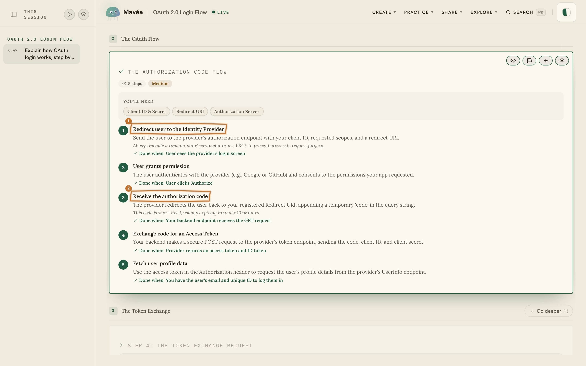<br /><sub><b>It marks what it's saying.</b> The pen lands on the exact line as the sentence is spoken.</sub></td>
    <td width="25%" valign="top">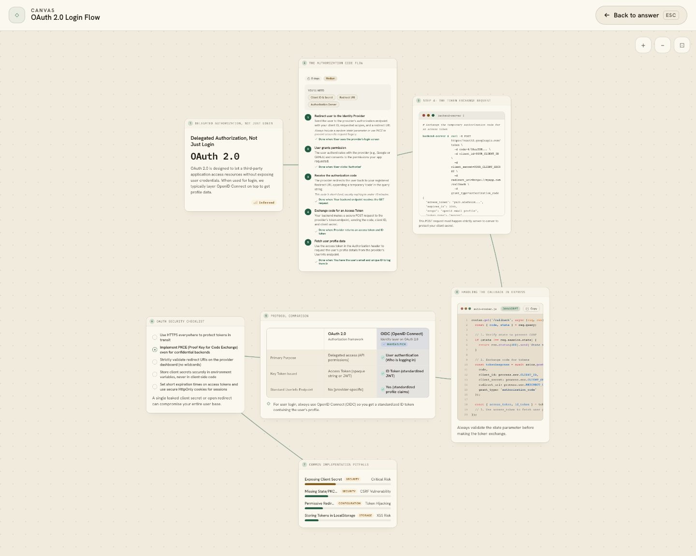<br /><sub><b>The same answer as a board.</b> Laid out in space, with the relationships drawn between them.</sub></td>
    <td width="25%" valign="top">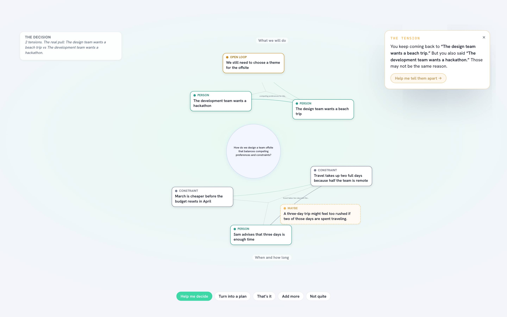<br /><sub><b>Think out loud first.</b> A ramble sorts itself into themes — and it names the tension you missed.</sub></td>
    <td width="25%" valign="top">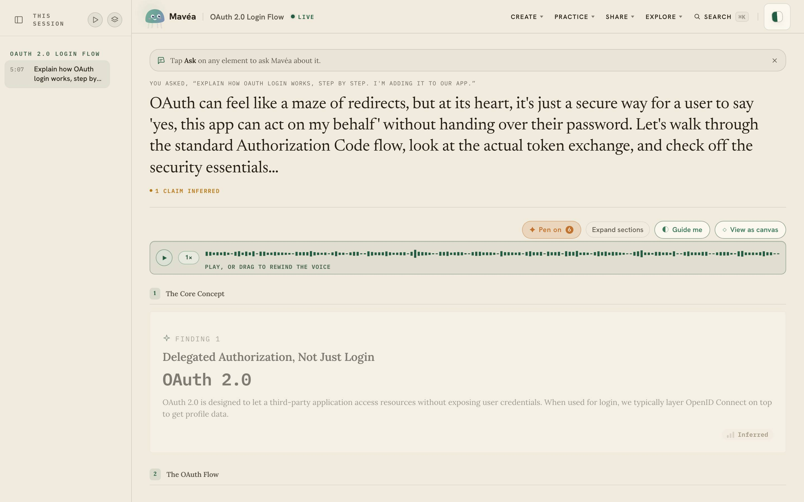<br /><sub><b>Scrub the voice.</b> Drag the spoken track and the canvas un-builds to what had been said.</sub></td>
  </tr>
  <tr>
    <td width="25%" valign="top">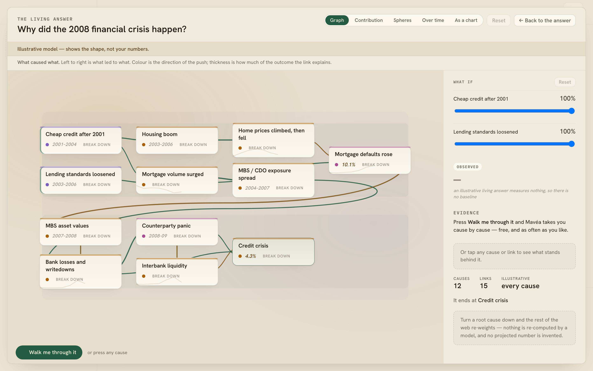<br /><sub><b>Walk the why.</b> A "why" answer opens into the causal web behind it — every cause traceable to a real quote.</sub></td>
    <td width="25%" valign="top">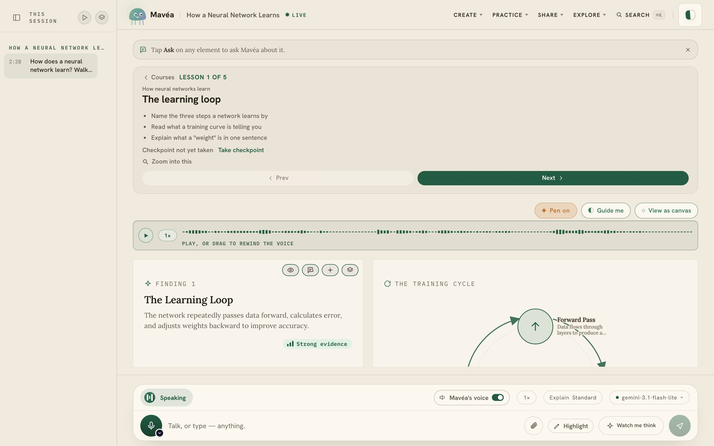<br /><sub><b>It builds you a course.</b> Ask to master something and get real lessons — objectives, a checkpoint, next steps.</sub></td>
    <td width="25%" valign="top">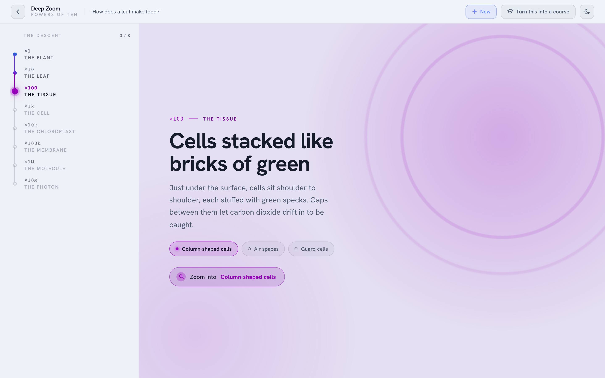<br /><sub><b>A topic, in powers of ten.</b> Telescope from the big picture to the finest mechanism.</sub></td>
    <td width="25%" valign="top">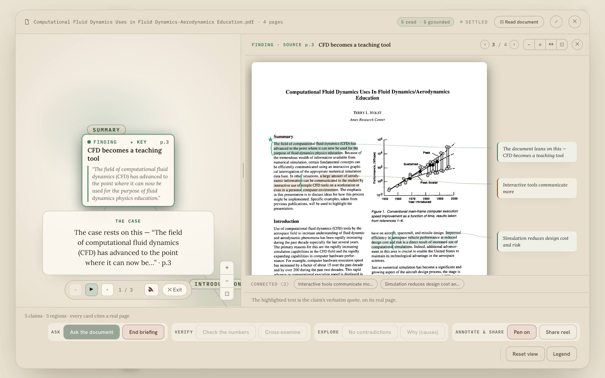<br /><sub><b>A document, claim by claim.</b> Every finding highlighted on the real page it came from.</sub></td>
  </tr>
  <tr>
    <td width="25%" valign="top">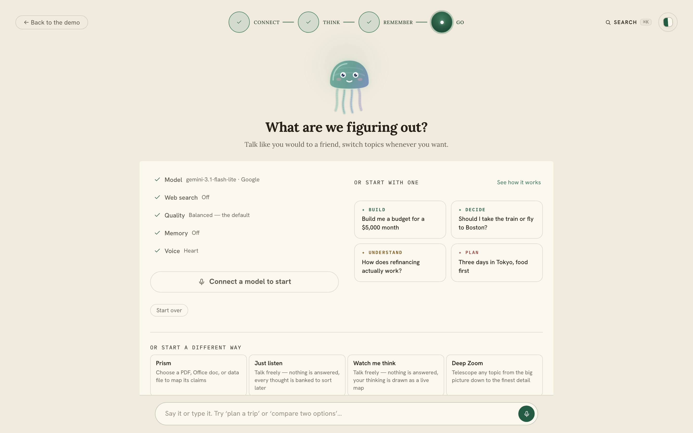<br /><sub><b>Start anywhere.</b> A new conversation offers every mode as a way in — no need to ask a question first.</sub></td>
    <td width="25%" valign="top">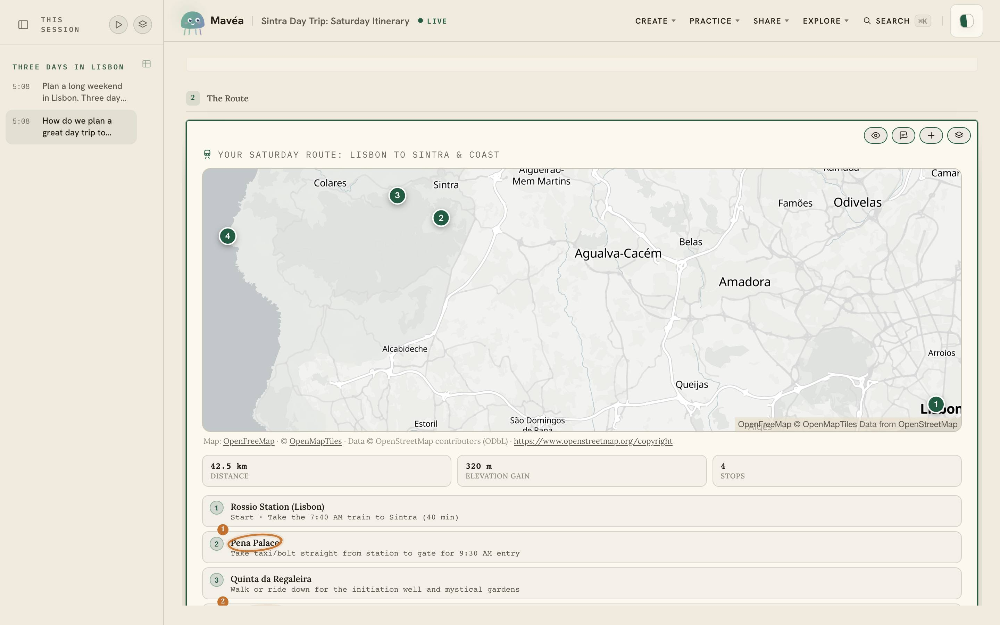<br /><sub><b>It picks the right form.</b> A route becomes a map; a day becomes an hour-by-hour plan.</sub></td>
    <td width="25%" valign="top">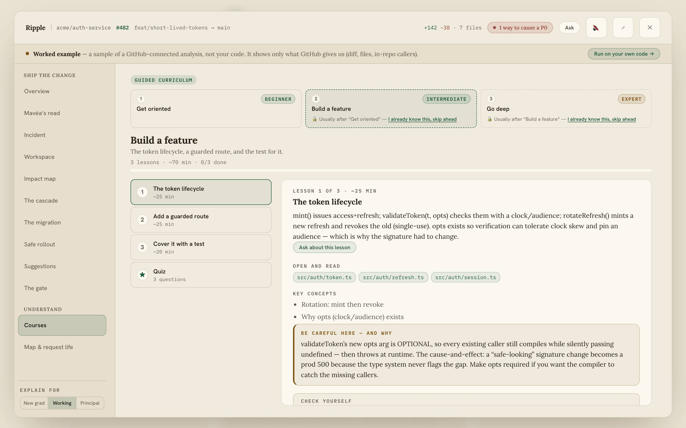<br /><sub><b>A repository, taught.</b> Beginner to expert, built from the code, with real files.</sub></td>
    <td width="25%" valign="top">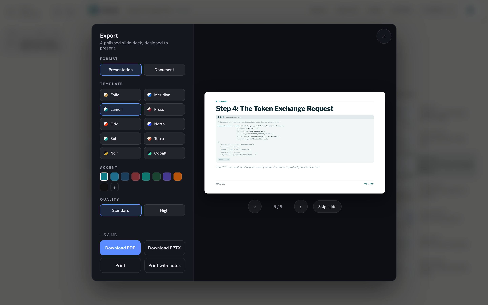<br /><sub><b>Out as a deck.</b> Ten skins, a live preview, PDF or PowerPoint.</sub></td>
  </tr>
  <tr>
    <td width="25%" valign="top">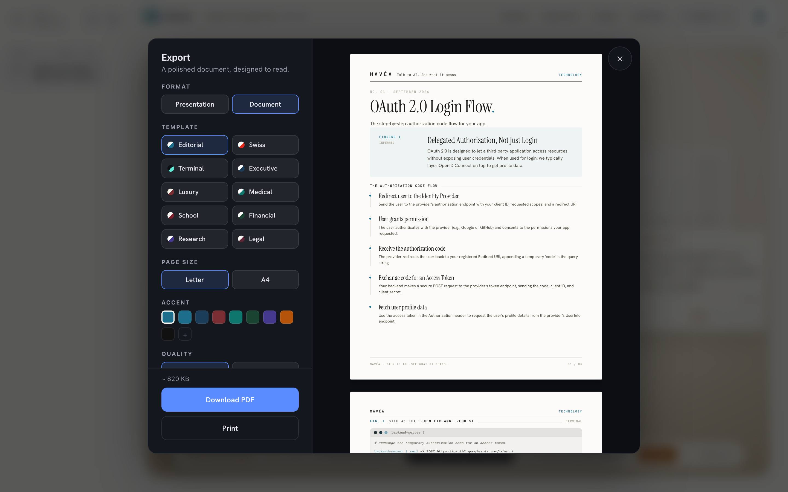<br /><sub><b>Or as a document.</b> The same answer set as a paper, ready to print or send.</sub></td>
    <td width="25%"></td>
    <td width="25%"></td>
    <td width="25%"></td>
  </tr>
</table>

## What it needs

Mavéa runs on your machine, not in a cloud.

|          | Minimum | Recommended |
| -------- | ------- | ----------- |
| **CPU**  | 4 cores | 8 cores     |
| **RAM**  | 8 GB    | 16 GB       |
| **Disk** | 3 GB    | 10 GB       |
| **Node** | 22.12+  | 24.11+      |

Any browser in [Baseline Widely Available](https://web.dev/baseline) — current Chrome, Edge,
Safari, or Firefox — on macOS, Windows, or Linux. **Minimum** covers the app with voice off,
alongside the browser and whatever else you already have open. **Recommended** adds the local
Kokoro + whisper.cpp services and a container runtime, with enough room that you never think about
it.

**Local speech costs real memory, and it's optional.** Kokoro holds roughly 1.3 GB resident;
whisper.cpp adds its local model and working memory; a desktop container VM adds its own overhead.
At the 8 GB minimum, leaving local speech off can be the better trade. `podman compose down` (or the
Docker equivalent) reclaims it whenever you want it back.

## Third-party commercial use

Generated media, bundled libraries, fonts, maps, and the local speech services are held to an
open-media and permissive-licence allowlist, enforced on every build by `pnpm check:licenses`.
It is an engineering control, not a legal opinion — the full policy, what the gate does and does
not cover, and the obligations that travel with the speech container are in
[docs/THIRD-PARTY-POLICY.md](docs/THIRD-PARTY-POLICY.md).

## 📄 Mavéa license

Mavéa is **source-available under the
[PolyForm Noncommercial License 1.0.0](./LICENSE)**. It is not licensed under MIT and is not
distributed under an Open Source Initiative-approved open-source license. The PolyForm license
permits use, modification, and distribution only for purposes it defines as noncommercial.
Commercial use requires separate written permission or a separate license from the applicable
rights holder.

That restriction applies to recipients of the PolyForm license. It does not stop an applicable
rights holder from selling or commercially licensing Mavéa, offering it under different terms, or
transferring rights it owns or controls, including as part of an acquisition. Third-party
components remain under their own licenses.

Copies of the software must keep the license's required notice:

> Required Notice: Copyright (c) 2026 Akash Maitra and Aryan Chordia

## Contact

- **Commercial license, trademark permission, or acquisition** — <trymavea@gmail.com>
- **Questions and feature ideas** — [GitHub Discussions](https://github.com/TryMaveaAI/mavea/discussions)
- **Security** — follow [SECURITY.md](./SECURITY.md); never report a vulnerability in a public issue
