# Security Policy

## Supported versions

`main` is the supported line — security fixes land there. There are no maintenance branches and no
backports to earlier releases; always run the latest `main`.

| Version | Supported |
| ------- | --------- |
| `main`  | ✅        |

## Reporting a vulnerability

Please **do not** open a public issue for security problems. Instead:

- **Preferred** — open a private report through GitHub:
  [**Report a vulnerability**](https://github.com/TryMaveaAI/mavea/security/advisories/new)
  (the repository's _Security → Advisories_ tab), or
- email the maintainers at **akash.maitra@gmail.com**.

Do not submit a public or external security pull request or attach exploit code unless a maintainer
requests it through the private reporting channel.

We take security reports seriously and review each one. Fixes are prioritised by severity and
issued at the maintainers' discretion; response times are best-effort and not guaranteed under a
service-level agreement (see [SUPPORT.md](./SUPPORT.md)). Please allow a reasonable window for a
fix before any public disclosure.

## Scope & design notes

```mermaid
flowchart LR
    subgraph browser ["Browser"]
        LS["session memory\n(optional encrypted local key blob)"]
        AD["provider adapter\n(key in Authorization header)"]
        LS --> AD
    end
    AD -->|"key + prompt"| P["operator-controlled same-origin proxy\n/llm/anthropic · /llm/openai · /llm/gemini\n/llm/grok · /llm/openrouter"]
    P --> PRV["Provider API\n(Anthropic · OpenAI · Gemini · xAI Grok · OpenRouter)"]
    style browser fill:#1a1a2e
```

The default development/self-hosted topology runs on infrastructure you control. Provider keys are
session-only by default; optional remembering encrypts them locally. The browser sends each key and
prompt through a **same-origin proxy**, which can see the credential in transit and must not log or
persist it, then onward to the chosen provider. This repository has no hosted account, telemetry, or
conversation-retention service, but a production deployment's proxy is still a privileged trust
boundary. Reports about key handling, the proxy paths (`/tts`, `/stt`, `/llm/*`), or dependency
vulnerabilities are especially welcome.

The **Your data** backup export (dashboards, memory, flashcards, and other local stores) writes
decrypted JSON to a file the user explicitly downloads; it deliberately **excludes provider and
search keys**, and import forces `rememberKey:false`, so no export or import path can persist a
credential. The resulting file is unencrypted and under the user's control.

## Accepted risks (defense-in-depth tradeoffs)

A couple of Content-Security-Policy relaxations are intentional and bounded. Each only becomes
exploitable _given_ an existing XSS — which the input pipeline is designed to prevent: model and
web-search output is tag-neutralized before render, and the few fields that carry markup pass a
strict DOMParser allow-list (rich text) or an SVG sanitizer.

- **`style-src 'unsafe-inline'`** is retained because the design system applies dynamic values and
  CSS custom properties through React `style` attributes throughout (chart geometry, theme tokens,
  the live `--voice-energy`/aura variables, focus/tour transforms). CSP nonces and hashes do not
  apply to inline `style` _attributes_, so dropping `'unsafe-inline'` would break theming with no
  equivalent. The residual exposure is CSS-only (no script execution).
- **Dynamic visual runtimes are bundled and code-split**, including Shiki, KaTeX, Leaflet, jsPDF,
  pdfjs-dist, openchemlib, mediabunny, and modern-screenshot; the application does not import
  executable JavaScript from a CDN. Generated JavaScript/TypeScript runs only after an explicit
  click in a bounded Worker with network/storage APIs removed. Python execution is disabled until
  it has an equally isolated, terminable runtime.
