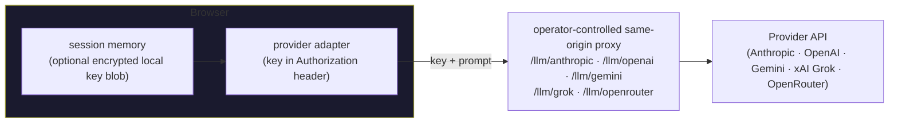

# Security Policy

## Supported versions

`main` is the supported line — security fixes land there. There are no maintenance branches and no
backports to earlier releases; always run the latest `main`.

| Version | Supported |
| ------- | --------- |
| `main`  | ✅        |

## Reporting a vulnerability

Please **do not** open a public issue for security problems. Instead:

- **Preferred** — open a private report through GitHub:
  [**Report a vulnerability**](https://github.com/TryMaveaAI/mavea/security/advisories/new)
  (the repository's _Security → Advisories_ tab), or
- email the maintainers at **trymavea@gmail.com**.

Do not submit a public or external security pull request or attach exploit code unless a maintainer
requests it through the private reporting channel.

We take security reports seriously and review each one. Fixes are prioritised by severity and
issued at the maintainers' discretion; response times are best-effort and not guaranteed under a
service-level agreement (see [SUPPORT.md](./SUPPORT.md)). Please allow a reasonable window for a
fix before any public disclosure.

## Scope & design notes

```mermaid
flowchart LR
    subgraph browser ["Browser"]
        LS["session memory\n(optional encrypted local key blob)"]
        AD["provider adapter\n(key in Authorization header)"]
        LS --> AD
    end
    AD -->|"key + prompt"| P["operator-controlled same-origin proxy\n/llm/anthropic · /llm/openai · /llm/gemini\n/llm/grok · /llm/openrouter"]
    P --> PRV["Provider API\n(Anthropic · OpenAI · Gemini · xAI Grok · OpenRouter)"]
    style browser fill:#1a1a2e
```

The default development/self-hosted topology runs on infrastructure you control. Provider keys are
session-only by default; optional remembering encrypts them locally, and Settings → Your data →
Forget everything on this device destroys the device key along with every store. The encryption
removes plaintext at rest; it does not stop code running as this origin (an injected script, or an
extension with access to the site), which `pnpm probe:extensions` demonstrates. The browser sends each key and
prompt through a **same-origin proxy**, which can see the credential in transit and must not log or
persist it, then onward to the chosen provider. This repository has no hosted account, telemetry, or
conversation-retention service, but a production deployment's proxy is still a privileged trust
boundary. Reports about key handling, the proxy paths (`/tts`, `/stt`, `/llm/*`), or dependency
vulnerabilities are especially welcome.

The **Your data** backup export (dashboards, memory, flashcards, and other local stores) writes
decrypted JSON to a file the user explicitly downloads; it deliberately **excludes provider and
search keys**, and import forces `rememberKey:false`, so no export or import path can persist a
credential. The resulting file is unencrypted and under the user's control.

### The development server's own key

`pnpm dev` reads one Gemini key from a gitignored `.env` and lets the local `/llm/gemini` proxy use
it when the page sends none. The proxy answers only this app's own pages (a matching Origin or
Referer, or `Sec-Fetch-Site: same-origin`), but anyone using that browser profile can still spend
it. Use a spend-capped key there and never expose the dev server beyond your machine.

## Accepted risks (defense-in-depth tradeoffs)

A couple of Content-Security-Policy relaxations are intentional and bounded. Each only becomes
exploitable _given_ an existing XSS — which the input pipeline is designed to prevent: model and
web-search output is tag-neutralized before render, and the few fields that carry markup pass a
strict DOMParser allow-list (rich text) or an SVG sanitizer.

- **`style-src-attr 'unsafe-inline'`** is retained for `style="…"` attributes inside sanitized
  markup (SVG illustrations, KaTeX MathML, Shiki's token colors). React's `style` prop goes through
  the CSSOM and needs no allowance. Inline `<style>` _elements_ are refused: `style-src` admits only
  same-origin stylesheets plus two hashes (the boot splash and an empty element the raster export
  fills through the CSSOM), so injected markup cannot bring its own stylesheet. The residual
  exposure is CSS-only (no script execution).
- **Trusted Types is enforced** (`require-trusted-types-for 'script'`, Chromium only). Sanitized
  markup reaches the DOM through the `mavea` policy; a `default` policy lets third-party code
  (MapLibre, modern-screenshot, Vite's worker loaders) write only markup with no active content and
  load only same-origin script URLs.
- **Dynamic visual runtimes are bundled and code-split**, including Shiki, KaTeX, Leaflet, jsPDF,
  pdfjs-dist, openchemlib, mediabunny, and modern-screenshot; the application does not import
  executable JavaScript from a CDN. Generated JavaScript/TypeScript runs only after an explicit
  click in a bounded Worker with network/storage APIs removed. Python execution is disabled until
  it has an equally isolated, terminable runtime.
