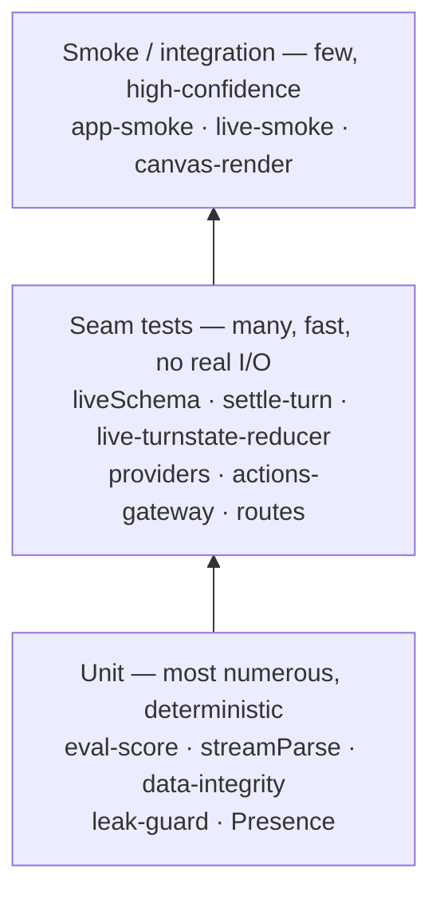

# Engineering standards

The bar every maintainer change is held to—and a reference for noncommercial evaluators permitted
by the license. Only the two authorized maintainers submit code or pull requests. If a maintainer
uses an AI agent, point it here.

## Principles

These draw on the field's best engineering writing — _Clean Code_, _A Philosophy of Software
Design_, _The Pragmatic Programmer_, _Refactoring_ — and each library's own guidance, all in
service of one goal: an **elite product that runs on any machine, is effortless to start, fun to
use, and secure.**

- **Clarity first.** Code is read far more than it's written — optimize for the next person.
- **Smallest correct change.** One concern per PR; no drive-by refactors or scope creep.
- **Modern and idiomatic.** Use the current best-practice idioms and the best features of the
  language, framework, and libraries (modern React 19 + TypeScript, current Vite / Vitest). Avoid
  deprecated patterns; when unsure, check the library's own docs rather than guessing.
- **Honest verification.** `tsc`, lint, format, tests, and build must pass, and you've exercised
  the real behaviour before calling it done.
- **Multiple reviews.** Non-trivial changes get more than one pass — a code-review pass _and_ an
  architecture/security pass — before they ship.

## Review checklist

Review every change against all of these. Add an **architecture review** for anything that
introduces a seam, a dependency, or a new module.

### Correctness

- [ ] Handles edge cases and the empty / loading / error / failure paths
- [ ] Types are sound — no `any` escape hatches or unsafe casts; discriminated unions stay exhaustive
- [ ] Tests cover the new behaviour; existing tests still pass

### Security

- [ ] No secrets in code or logs; provider keys are session-only by default (optional encrypted
      local store) and transit only through the documented same-origin proxy to the provider
- [ ] All external input (LLM output, user text, uploaded files) is treated as untrusted and validated/escaped — no injection, no unsanitized HTML
- [ ] `dangerouslySetInnerHTML` only on content we control and sanitize
- [ ] No new network egress or data collection; dependencies are trusted and minimal

### Scalability & performance

- [ ] No needless re-renders, O(n²) loops, or unbounded growth; large lists are bounded/virtualized where needed
- [ ] **No leaks** — every timer, listener, subscription, interval, and object URL is cleaned up; async is cancellable (`AbortController`); audio/network/animation loops stop on unmount. In components, drive timers with the `useTimeout` / `useInterval` hooks (`src/hooks`) so they cancel automatically. Prove it with a test, don't just intend it
- [ ] Bundle impact is considered — prefer **zero new runtime dependencies** (beyond `react` + `react-dom`, Mavéa's own footprint is a handful of feature-scoped, lazy-loaded libraries — see README's "Built with")

### Architecture & design

- [ ] Fits the existing seams (Intent → engine → beats → canvas; one `ProviderAdapter`; data-driven blocks)
- [ ] **Extensible by data, not by widening core switches** — a new block is a family file + one registry line, not a renderer edit
- [ ] Clear module boundaries, no circular dependencies, the right abstraction (neither over- nor under-engineered)

### Readability & maintainability

- [ ] Names say what things are/do; comments explain _why_, not _what_
- [ ] Matches the surrounding code's style, structure, and idioms
- [ ] Dead code removed; docs (`README` / `ARCHITECTURE` / `CONTRIBUTING`) updated in the **same** change
- [ ] Accessible UI (labels, roles, keyboard, contrast); respects light/dark and reduced-motion

## Testing

Tests are the safety net that lets maintainers change Mavéa with confidence. The bar: **when the suite is
green, you can trust that nothing broke and the app works.**

- **Test behaviour, not implementation.** Assert what the user or caller observes; avoid brittle snapshots and over-mocking.
- **Fast & deterministic.** No real network, real timers, or randomness — mock them (`vi.mock`, `vi.useFakeTimers`). A flaky test is worse than no test: fix it or delete it.
- **Cover the load-bearing seams** — the data contract (every topic, block, and persona is valid and wired), the canvas (every component renders), the turn machinery (reducer + beat runner + engine), the Live pipeline (validate → repair → honest fallback), and a smoke render of each surface.

- **Readable.** `describe` / `it` read like sentences; one behaviour per test; clear arrange–act–assert.
- **Grows with the code.** A new feature or bug fix ships with a test that would have caught it. Run `pnpm test`, and `pnpm verify` before pushing.
- **One file per family or feature, not per component.** A test _file_ is not free: each one boots
  its own environment and module graph before a single assertion runs, and that fixed cost is paid
  on every developer's machine and every CI run. Add a new block's regression test to its family's
  file (`tests/canvas-<family>.test.tsx`) as a new `describe`, rather than creating
  `tests/canvas-<family>-<component>.test.tsx`. Split a file only when it stops being readable
  (~1,200 lines) or when it needs a `vi.mock` that must not apply to its neighbours.
- **Assert over the data domain, not the fixture.** The most valuable tests here are parameterised
  — `it.each([2, 4, 6, 10])` for label collision, the whole value range for axis containment. A
  test pinned to one authored fixture breaks on content edits and catches no real bug.
- **Don't re-prove what the gauntlet proves.** `tests/canvas-gauntlet.test.tsx` already mounts every
  registered block at three fixture intensities and checks that it renders a card, emits no
  `undefined`/`NaN` text, and leaks no overlay on unmount. A per-component "renders without
  crashing" test adds nothing; spend the test on the behaviour that actually broke.

### Two things the unit suite cannot see

A green suite proves the logic holds. It says nothing about whether a card is legible on a phone or
whether the app is usable on a slow laptop — and both of those are how people actually meet Mavéa.
Each has a script. The layout audit runs against a dev server (`pnpm dev`); the two performance
probes measure the shipped artifact, so build and serve it first (`pnpm build && pnpm preview`,
then pass `--url http://localhost:4173`).

- **`pnpm audit:responsive`** — the geometry suite, one command: it starts a dev server, sweeps the
  block library and every surface (every route in `src/routeTable.ts`, plus Live's takeover states)
  across the width ladder from 320 to 3440, at 1× and zoomed to 125% and 150%, in both themes. Zoom is
  emulated the way a browser does it — the same window as a narrower CSS viewport at a higher device
  scale factor. It flags horizontal page scroll, a box past the window or a clipping ancestor, text
  standing on end (a collapsed column), two runs of text printed over each other, controls under the
  44px thumb floor at phone and tablet widths, and a page that sets its headings, body or buttons in
  more sizes than one design would. `-- --ci` is the per-push subset; `pnpm audit:responsive:fast` is
  the pre-push cut (the surfaces whose own files changed, three sizes, a minute). Every moment is
  stamped by the page's own clock, never by a harness wait. Screenshots land in `.audit-out/` for a
  person to look at — nothing compares them, so a font bump on a CI image cannot flip a verdict.
- **`pnpm audit:ui`** — renders all 625 browsable block types in `#/gallery` across the full width range (a folded
  phone at 280px through 4K) in both themes; pass `-- --variants all` to sweep base, verbose, and
  minimal data shapes (the weekly gate does). It reports three faults: content **clipped** out of its
  card, text **overlapping** other text, and type shrunk **below legibility**. The clip check is the
  gallery's own; the other two exist because a collision clips nothing, so nothing else catches it —
  and it is the failure the eye notices first. It measures the ink, line by line, and knows to ignore
  the back of a flip card, text scrolled out of an overflow pane, and a line a `line-clamp` cut away.
- **`pnpm perf`** — drives every surface under real CPU throttling (`--throttle 6` ≈ a budget laptop,
  `4` ≈ mid-range) and reports when the surface is actually _there_, how long the main thread was
  blocked (i.e. how long a click would have gone unanswered), and — the one that catches real
  regressions — whether any heavy asset (the voice model, its WASM, the on-device embedder, the block
  library) was pulled down **before the user asked for anything**. Nothing heavy should load on
  arrival; it loads when someone shows intent.
- **`pnpm perf:memory`** — warms every public route, then repeatedly mounts/unmounts them in one
  production Chromium process with forced GC. It fails on retained heap, DOM nodes, documents,
  event listeners, page errors, or console errors above the explicit budgets.

## Responsive rules

Every surface and every block is fluid at every width and zoom, and the rules that keep it so are
enforced, not remembered:

- **Never add fixed widths or heights, px font sizes, or one-off media queries.** Use the tokens in
  `src/styles/tokens-base.css`: the breakpoint ladder (range syntax, `width <= 720px`), the fluid
  type ramp (`--fs-2xs` … `--fs-hero`, Utopia's method, regenerated by `scripts/utopia-scale.mjs`),
  the container-relative spacing (`--sp-fluid-*`), `--content-max` and `--tap-min`. A width that must
  be stated in px is fluidised (`min(240px, 100%)`); `vh` is `dvh` or `svh`.
- **Shared components use container queries.** Every block family, the cards, the rails and the nav
  answer to the box they are drawn in (`.card`, `.card-grid`, the Lens stage, the Study slot, the
  world's parts rail, the side rail, the top bar, the dock and the transcript are query containers),
  never to the window — the same block sits in a col-3 slot and a col-12 slot on one screen.
- **Any UI change must pass `pnpm audit:responsive` before it is done**, and `pnpm lint` (which
  now runs stylelint over every stylesheet) must be clean.
- **Exceptions require a `stylelint-disable-next-line` comment with the reason**, on the line
  before the declaration. The reason is mandatory and a disable that no longer suppresses anything
  is itself an error, so the list of exceptions can only shrink honestly. The rules and the argument
  for each are in `stylelint.config.js`.

## How the bar is enforced

- **Automated** — CI runs `typecheck · lint · format · test · build` on every push and PR, and a
  **pre-push hook** runs `pnpm typecheck`, `pnpm lint` and `pnpm audit:responsive:fast` locally as a
  fast sanity check before anything reaches CI. The responsive gate (`pnpm audit:responsive --ci`)
  runs on every push that can move a pixel; the rest of the real-browser gauntlet (the full
  responsive matrix in both themes and at every zoom, touch, interaction, reel, perf and memory
  audits) runs weekly and on demand from the Actions tab — it measures rendered geometry, which is
  machine-sensitive, so the broad sweep reports on a schedule while the likely regressions block a
  push. Pre-commit hooks format and lint staged files; commit messages are
  Conventional-Commit-linted; Dependabot keeps dependencies fresh; `pnpm knip` flags unused
  files, exports, and dependencies; and a
  leak-guard test mounts then unmounts every block under fake timers and fails if any timer is
  left pending — so an uncleaned `setTimeout`/`setInterval` can't merge.
- **Human** — `CODEOWNERS` requests review, the pull-request template carries this checklist, and
  significant changes get a second review plus an architecture review.
- **AI-assisted work** — make multiple independent passes (a code-review pass and an
  architecture + security pass) and self-review the diff against this list **before** opening a PR.
