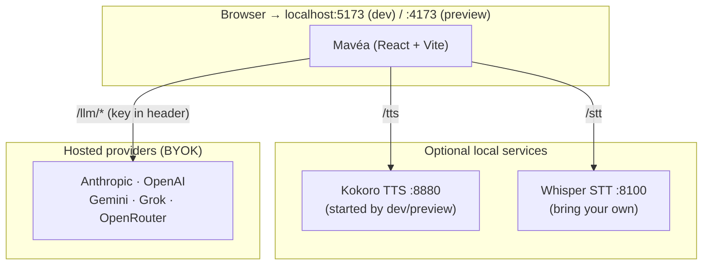

# Live mode setup

This guide covers everything needed to run Mavéa in Live mode — the surface where you talk to a
real model and see the answer on the canvas.

For architecture background — the turn contract, the proxy diagram, and how the BYOK key flow
works — see [ARCHITECTURE.md](../ARCHITECTURE.md).

Live uses probabilistic AI and independent third-party services. Output may be inaccurate,
incomplete, or outdated and is not professional advice. You are responsible for verification,
provider accounts, usage charges, deployment security, and any action you confirm. See the
[Terms](../TERMS.md), [Disclaimer](../DISCLAIMER.md), and [Privacy Notice](../PRIVACY.md).

---

## Prerequisites

**Node >= 24.11** (run `corepack enable` once to activate the pinned pnpm). That's enough for the app
and its local development proxies; Live requests still go onward to the provider you select.

**Optional: a container runtime**, only if you want local speech — Kokoro TTS (the voice) and
whisper.cpp STT (mic transcription) are the two containerized services, both running on your
machine at no per-use cost. Without them Mavéa's visual and text flows still work — spoken lines
appear as captions, and mic transcription stays off rather than falling back to a cloud service.
[Podman](https://podman.io/) is the recommended free/open-source runtime; Docker also works under
its separate terms.

---

## Quick start

```sh
pnpm install
pnpm dev           # → http://localhost:5173
```

Open **http://localhost:5173**, click **"Open Mavéa"**, pick a provider, and paste your key.
That's the whole setup. The key stays in memory by default; if you enable **Remember keys**, it is
stored locally in an AES-GCM-encrypted blob. Each request carries the key through the same-origin
proxy running on your machine (or operated by your production deployment) to the selected provider.
The proxy operator can access the key and request content in transit. Provider terms, retention,
quotas, and charges apply.

---

## Model selection

Live is bring-your-own-key across five hosted providers. Defaults are deliberately the fast,
low-cost tier — the model field accepts any id, so stronger models are always one paste away:

| Provider   | Default model             | Notes                                                                                  |
| ---------- | ------------------------- | -------------------------------------------------------------------------------------- |
| Anthropic  | `claude-haiku-4-5`        | Fast, low-cost default; `claude-sonnet-5` is the suggested step-up                     |
| Gemini     | `gemini-3.1-flash-lite`   | Fast, low-cost default; `gemini-3.8-flash` is the suggested step-up                    |
| OpenAI     | `gpt-5.6-luna`            | Newest light tier — nano's price with a 1M window; `gpt-5.4-mini` is the step-up       |
| Grok       | `grok-4.3`                | Fast, low-cost default; `grok-4.6` is the flagship step-up                             |
| OpenRouter | _(none — paste your own)_ | One key, hundreds of models; `google/gemini-3.1-flash-lite` is a current starting pick |

Each provider tile in the Connect step links to where you get a key, and the readiness strip
verifies the key + model before you commit.

**Not every model can drive the canvas.** Mavéa's answers are structured output — a typed
`blocks` array — so a model that ignores a request for JSON cannot render one, at any budget or
timeout. Some preview and reasoning models do exactly that: they reply with a planning monologue in
plain prose, or spend their whole completion budget thinking and emit nothing at all. When that
happens Mavéa says so on the card rather than blaming the moment, because retrying the same model
gets the same result. Pick one that supports JSON mode.

**A note on OpenRouter's `:free` routes.** A `:free` variant is a separate, heavily rate-limited
pool that queues behind every other free user — it is not the paid model of the same name at a
lower price. Mavéa recognises the suffix and adapts rather than pretending otherwise: it asks for a
smaller canvas and a shorter menu so the answer fits in the time the route actually has, waits
longer before giving up, and if the stream is still cut off it keeps the blocks that arrived and
labels the answer as cut short instead of discarding it. Expect a slower turn and fewer blocks than
the same question on a paid route; the model picker says so when you type one.

---

## The voice (optional)

Mavéa speaks through [Kokoro](https://github.com/remsky/Kokoro-FastAPI), a natural local TTS —
the one service that runs in Docker. You don't normally start it yourself: `pnpm dev` brings the
container up alongside Vite, and `pnpm preview` — the same server `npx @mavea/mavea` runs — does the
same when serving the production build. Both proxy `/tts` to `localhost:8880` (override with
`KOKORO_URL`).

Starting it by hand is only needed for hand-rolled hosting of `dist/`, where nothing proxies
`/tts` for you (your edge has to do that — see the production note below):

```sh
docker compose up -d      # Kokoro TTS on :8880
```

Kokoro downloads its voice model on first start, so the first few lines may be silent until it's
ready. Without the container, TTS falls back to captions and the transcript remains available.
The in-conversation **Mavéa's voice** toggle turns output speech off without changing microphone
input; a paced answer then reveals in full immediately with captions, notes, and Pen marks.

**Speech-to-text** uses the bundled whisper.cpp container on `localhost:8100` by default. `pnpm
dev` starts it with Kokoro; if it is unavailable, microphone transcription stays unavailable and
typing continues to work. Mavéa never falls back to a browser-vendor speech-recognition service.
If a deployment overrides `WHISPER_URL`, microphone audio is sent through the same-origin proxy to
that configured endpoint, which must be covered by the operator's security and privacy notice.

---

## Actions

Mavéa proposes **no side-effecting actions** — it can't add a calendar event, send a message, or
touch an external account, and it never claims to have. The in-product "Connect apps" write-actions
feature (and its Settings panel) was removed: the handful of integrations that could be honored end
to end weren't worth a surface that implied more than it delivered.

Ripple's GitHub access is unrelated and unchanged — it reads pull requests, diffs, and repo trees
**directly from api.github.com in the browser** (public repos need nothing; a private repo works
once you paste a read-only token), so it needs no gateway or server-side credentials.

> The standalone actions gateway (`gateway/`, `pnpm actions`) is retained for now but is no longer
> wired into the app; a follow-up removes it entirely.

---

## Service topology



All arrows go through the local same-origin proxy — Vite's in dev, the `pnpm preview` /
`npx @mavea/mavea` server for the production build — so the browser makes same-origin requests. The
browser necessarily holds the BYOK credential the user entered, and the proxy can see it in transit;
neither the app nor proxy logs or persists it. A production deploy must replicate the `/llm/*`
(and, if used, `/tts`, `/stt`) proxies at the infrastructure level and secure that trust
boundary — see [ARCHITECTURE.md](../ARCHITECTURE.md#production-proxy-requirement).
Modified deployments can add logging, so verify the operator and configuration you actually use.

---

## Troubleshooting

**No voice / lines show as captions only**
The Kokoro container isn't running (or is still downloading its model on first start). Run
`docker compose up -d` and give it a minute; `curl http://localhost:8880/health` should answer.
Mavéa degrades gracefully in the meantime — captions and the transcript carry every line.

**"Couldn't reach <provider>" on a turn**
Check the key in **Live → Settings** (the readiness strip re-probes on every change) and your
network. A 401 means the key is invalid; a 404 usually means the model id is wrong.

**Mic does nothing**
Voice input needs a browser with the Web Speech API (Chrome or Edge) and mic permission for
the site. The composer surfaces the exact cause inline when it can.

**Port conflicts**

| Port | Service                                                  | Override                        |
| ---- | -------------------------------------------------------- | ------------------------------- |
| 5173 | Vite dev server                                          | `--port` flag on `pnpm dev`     |
| 4173 | Production preview (`pnpm preview` / `npx @mavea/mavea`) | `--port` flag or `PORT` env var |
| 8880 | Kokoro TTS                                               | configure in `KOKORO_URL`       |
| 8100 | Whisper STT                                              | configure in `WHISPER_URL`      |
