# Actions gateway

> **Deprecated / unwired.** The in-product write-actions feature was removed, so the app no longer
> calls this gateway. It is retained only until a follow-up deletes it. Ripple's GitHub access does
> **not** use it — that reads api.github.com directly in the browser (see
> `src/live/ripple/ingest/githubBrowser.ts`).

This is the small server that let Mavéa **do things**, not just answer — add a Google Calendar
event or open a draft GitHub pull request. When a user confirmed an action on its card, the browser
POSTed to `/actions/<id>`; the dev server (or a production proxy) forwarded that to this gateway,
which holds the credentials and makes the real call. The browser never sees a token.

```mermaid
flowchart LR
    subgraph browser ["Browser"]
        UI["ActionProposal card\n(user confirms)"]
        RUN["POST /actions/myservice.doThing"]
        UI --> RUN
    end
    subgraph proxy ["Dev: Vite proxy  /  Prod: your reverse proxy"]
        PR["/actions/* → :8910"]
    end
    subgraph gateway ["actions-gateway.mjs"]
        GW["route /<id>"]
        CON["connector(args, env, fetch)"]
        ENV["process.env\n(GOOGLE_OAUTH_TOKEN\nGITHUB_OAUTH_TOKEN…)"]
        GW --> CON --> ENV
    end
    EXT["External API\n(Google Calendar · GitHub)"]

    RUN --> PR --> GW
    CON -->|"real HTTP call\n(token from env)"| EXT
    style browser fill:#1a1a2e
    style gateway fill:#0d2b0d
```



It's deliberately dependency-free — Node's built-in `http` plus the runtime's global `fetch` — so
it runs on a bare `node` image with no build step, in the same spirit as the rest of Mavéa (the
app's only runtime deps are `react` + `react-dom`).

## How auth works (single shared gateway)

One gateway holds **one** set of credentials — the deployer's own connected accounts. Everyone
using that deployment acts through them. That's the right fit for a self-hosted app: connect once,
no per-visitor login. (Per-user OAuth would need a stateful backend with token storage and
sessions — intentionally out of scope.)

A connector with no credentials here simply reports that it isn't set up.

## Hardening

The gateway holds real credentials, so treat it as a trusted backend, not a public endpoint:

- It binds `127.0.0.1` by default. Setting `ACTIONS_HOST` to any non-loopback address makes startup
  fail unless `GATEWAY_SECRET` is at least 32 characters. Reach it through the app's same-origin
  `/actions/*` proxy (Vite in dev, your authenticated reverse proxy in a remote deployment).
- Action execution requires a short-lived, single-use confirmation token bound to the exact action
  and arguments. The gateway records metadata-only audit events (action id, outcome, duration),
  never request content, credentials, OAuth codes, or tokens.
- Input is **validated and bounded** at the connector: the HTTP layer caps the request body
  (64 KB), every text field is length-capped, and any value interpolated into an API path is
  collapsed to a single line and charset-checked so a crafted value can't retarget the request.
- GitHub only ever opens a **draft** PR — there is no merge, comment, or delete path.
- For a shared/remote deployment, keep the required shared secret in the proxy, add user access
  control and TLS there, and rotate both the shared secret and OAuth tokens regularly.

## Run it

```sh
pnpm actions     # → http://localhost:8910  (GET /healthz lists the connectors)
```

Plain Node, no dependencies, no container — `pnpm dev` proxies `/actions` to it.

## Connect your accounts

Set these in the gateway's environment (e.g. the repo's `.env` — `pnpm actions` loads it — or exported
before `pnpm actions`). All are optional — leave one unset and that connector just reports itself
unconfigured.

| Env var               | Powers               | How to get it                                                                                                                                                                                                                                                  |
| --------------------- | -------------------- | -------------------------------------------------------------------------------------------------------------------------------------------------------------------------------------------------------------------------------------------------------------- |
| `GOOGLE_OAUTH_TOKEN`  | `calendar.addEvent`  | An OAuth 2.0 **access token** with the `calendar.events` scope (e.g. from the [OAuth Playground](https://developers.google.com/oauthplayground/)). Access tokens are short-lived — wire a refresh flow for anything long-running.                              |
| `GITHUB_OAUTH_TOKEN`  | `github.openDraftPr` | A GitHub token (fine-grained PAT or OAuth) with `pull_request` write on the target repo. Only ever opens a **draft** PR. The built-in OAuth flow requests `public_repo` by default; set `GITHUB_OAUTH_SCOPE=repo` only when private repositories are required. |
| `GITHUB_DEFAULT_REPO` | `github.openDraftPr` | The repo to open PRs against, in `owner/name` form (e.g. `acme/widgets`). Validated against GitHub's name charset before use.                                                                                                                                  |

GitHub only ever opens a **draft** PR; it has no merge or delete path, so nothing lands until the
user marks the PR ready themselves.

## Add a connector

1. Add the action to the app's catalog: [`src/live/actions/catalog.ts`](../src/live/actions/catalog.ts).
2. Add a connector function here in [`connectors.mjs`](./connectors.mjs) keyed by that same id, and
   read its credentials from `env`.
3. Cover it in [`tests/actions-gateway.test.ts`](../tests/actions-gateway.test.ts) — the connector
   core is pure (env + fetch are injected), so every branch is testable without a socket.

The HTTP layer in [`actions-gateway.mjs`](./actions-gateway.mjs) needs no changes — it routes
`/<id>` to whatever connectors are registered.
